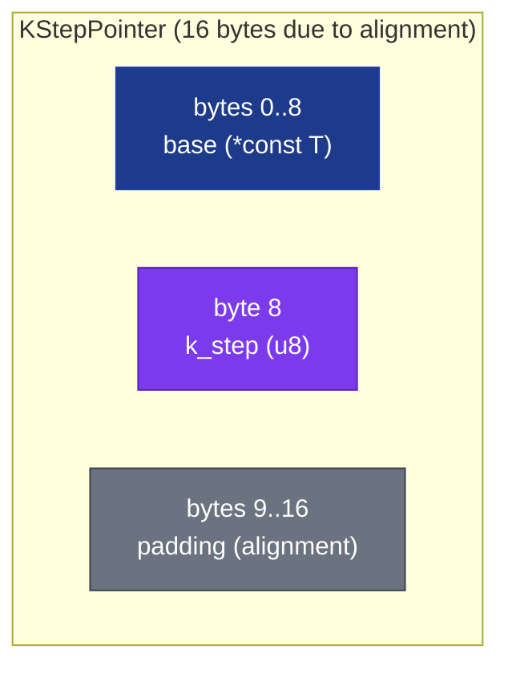

# KStepPointer&lt;T&gt; and StridedIter&lt;T&gt;


_%3C%3C_k__step-success)


A typed strided pointer that encodes the iteration stride as
`log2` (k_step: u8) instead of a runtime `usize`. The byte
stride between consecutive elements is
`size_of::<T>() << k_step`. Because the multiplier is a const
shift amount rather than a multiplicand, the compiler can emit
`SHL` with an immediate operand instead of `IMUL` per step.

> **The "stride is a shift, not a multiply" primitive.** Same
> architectural shape as BLAS row/column strides and NumPy
> strided arrays - but with the stride encoded as `k_step: u8`
> (log2-of-stride-multiplier) so it survives as a const through
> the codegen pipeline. The advantage is small but measurable
> on loops where the stride arithmetic is a meaningful fraction
> of the body.

**Constraints (read first):**

- **In-process only.** `base: *const T` is a real machine
  pointer, not portable across processes.
- **`new` and `tight` and `cache_line` are all `unsafe`.** The
  caller asserts `base` is valid and that every strided position
  `base + i * stride` stays in bounds for the indices the caller
  will visit.
- **`get(i)` is `unsafe`** and is unchecked. There is no
  bounds-test on `i`; out-of-range indices silently produce
  pointers past the array.
- **Stride is fixed at construction.** A single `KStepPointer`
  cannot adapt its stride mid-iteration. For variable-stride
  workloads (e.g. CSR sparse matrices with per-row strides) use
  a different abstraction.
- **`k_step: u8` limits stride to `sizeof(T) << 255`.** In
  practice the cap is the address space; usable values are
  `0..=12` (covers tight packing through page-aligned strides).
- **No iteration over **mutable** elements.** `KStepPointer<T>`
  exposes `&T` only; for mutable strided iteration use the
  unsafe raw-pointer math via `at(i)` and the caller's own
  unsafe mutable deref. The crate does not ship
  `KStepMutPointer<T>` today.
- **Size is 16 bytes due to alignment.** The struct contains a
  pointer (8 bytes, 8-byte alignment) + u8 + PhantomData. Rust
  rounds up to 16 bytes for the next 8-byte boundary, so
  `KStepPointer<u64>` is twice the size of a bare pointer.
- **Modern x86 `IMUL` is 3-cycle pipelined.** The bench wins
  are modest (~4% on the shipped scan); on older or simpler
  architectures the gap is larger.

---

## Table of contents

- [What it is](#what-it-is)
- [Why k_step (log2 stride)](#why-k_step-log2-stride)
- [Layout](#layout)
- [k_step values](#k_step-values)
- [API at a glance](#api-at-a-glance)
- [Worked example](#worked-example)
- [Benchmark results](#benchmark-results)
- [Use case patterns](#use-case-patterns)
- [Known limitations (verified)](#known-limitations-verified)
- [Common pitfalls](#common-pitfalls)

---

## What it is

`KStepPointer<T>` is a `(base, k_step)` pair:

```rust
pub struct KStepPointer<T> {
    base: *const T,
    k_step: u8,
    _phantom: PhantomData<*const T>,
}
```

The address of element `i` is computed as:

```rust
addr_i = base + i * (size_of::<T>() << k_step)
```

The `<< k_step` is the load-bearing piece: it's a single
SHL-with-immediate when `k_step` is propagated as a compile-time
constant.

`StridedIter<'a, T>` is the iterator companion:

```rust
pub struct StridedIter<'a, T> {
    ptr: KStepPointer<T>,
    i: usize,
    count: usize,
    _life: PhantomData<&'a T>,
}
```

Implements `Iterator<Item = &'a T>` and `ExactSizeIterator`.

## Why k_step (log2 stride)

The standard approach to strided iteration uses a runtime
`stride: usize`:

```rust
for i in 0..n {
    let p = unsafe { base.cast::<u8>().add(i * stride).cast::<T>() };
    consume(unsafe { &*p });
}
```

This compiles to an `IMUL` per step (multiply `i * stride`).
On modern x86, `IMUL` is 3-cycle latency on a dedicated unit,
pipelined to one result per cycle. On older / simpler chips
(early Atom, in-order ARM, RISC-V without M extension) `IMUL`
costs more.

With `KStepPointer`, the stride is encoded as `k_step: u8`
where the actual byte stride is `size_of::<T>() << k_step`. The
codegen pattern becomes:

```text
load addr_offset = i << k_step_constant
load base + addr_offset
```

`SHL` with immediate is 1-cycle latency, every cycle, on every
modern architecture. The compiler emits the immediate when the
caller constructs the pointer with a compile-time-known
`k_step`.

## Layout



The 7 bytes of padding are Rust's natural alignment requirement
for the `*const T` field. The struct could be made smaller via
`#[repr(packed)]` but at the cost of misaligned pointer access
which is undefined behaviour on some targets.

## k_step values

| `k_step` | Stride (T = u64) | Stride (T = u8) | Use case |
|---:|---:|---:|---|
| 0 | 8 B | 1 B | Tight contiguous Vec / array |
| 1 | 16 B | 2 B | Every other element |
| 2 | 32 B | 4 B | Sub-quarter access |
| 3 | 64 B | 8 B | SIMD lane stride OR cache-line for T=u64 |
| 6 | 512 B | 64 B | Cache-line stride for T=u8 |
| 12 | 32 KB | 4 KB | Page-aligned stride |

`KStepPointer::cache_line(base)` picks the smallest `k_step`
such that the stride is at least 64 bytes (one cache line),
selecting based on `size_of::<T>()`.

## API at a glance

<details open>
<summary><b>Construction</b></summary>

| Method | Signature | Notes |
|---|---|---|
| `new(base, k_step)` (unsafe) | `const unsafe fn(*const T, u8) -> Self` | Generic constructor |
| `tight(base)` (unsafe) | `const unsafe fn(*const T) -> Self` | `k_step = 0` (contiguous) |
| `cache_line(base)` (unsafe) | `const unsafe fn(*const T) -> Self` | Picks smallest `k_step` for stride >= 64 B |

</details>

<details open>
<summary><b>Inspection</b></summary>

| Method | Returns | Notes |
|---|---|---|
| `base()` | `*const T` | Raw base pointer |
| `k_step()` | `u8` | Encoded log2 stride multiplier |
| `stride()` | `usize` | `size_of::<T>() << k_step` |

</details>

<details open>
<summary><b>Access</b></summary>

| Method | Signature | Notes |
|---|---|---|
| `at(i)` (unsafe) | `unsafe fn(&self, usize) -> *const T` | Raw pointer to i-th element |
| `get(i)` (unsafe) | `unsafe fn(&self, usize) -> &T` | Borrow i-th element |
| `iter(count)` (unsafe) | `unsafe fn(&self, usize) -> StridedIter<'_, T>` | Iterator over `count` strided elements |

</details>

<details>
<summary><b>StridedIter&lt;T&gt;</b></summary>

| Trait | Notes |
|---|---|
| `Iterator<Item = &'a T>` | Yields strided references |
| `ExactSizeIterator` | Reports remaining count via `size_hint` |

</details>

## Worked example

```rust
use subetha_pointers::kstep_pointer::KStepPointer;

// 4x4 row-major matrix stored as a flat Vec<u64>. Each row is
// 4 elements * 8 bytes = 32 bytes. Walking column 0 means
// stride 32 bytes = sizeof(u64) << 2, so k_step = 2.
let matrix: Vec<u64> = (0..16u64).collect();
let col_0 = unsafe { KStepPointer::new(matrix.as_ptr(), 2) };
assert_eq!(col_0.stride(), 32);

// SAFETY: 4 strided positions at stride 32 = 96 bytes from
// matrix.as_ptr() = within the 128-byte allocation.
let column: Vec<u64> = unsafe { col_0.iter(4) }.copied().collect();
assert_eq!(column, vec![0, 4, 8, 12]);

// Cache-line stride: for u64, stride 64 = k_step 3. Walks every
// 8th element.
let cl = unsafe { KStepPointer::<u64>::cache_line(matrix.as_ptr()) };
assert_eq!(cl.k_step(), 3);
assert_eq!(cl.stride(), 64);

// Tight packing for default Vec iteration.
let tight = unsafe { KStepPointer::tight(matrix.as_ptr()) };
assert_eq!(tight.stride(), 8);  // sizeof(u64)
let all: Vec<u64> = unsafe { tight.iter(16) }.copied().collect();
assert_eq!(all, (0..16u64).collect::<Vec<_>>());
```

## Benchmark results

256 strided loads (1024-element matrix walked at stride 32).
Measured on Windows 11 / Zen+ R7 2700, criterion at
`--measurement-time 2 --warm-up-time 1 --sample-size 30` (middle
estimate of each [low, mid, high] triple).

### Bench fairness

The runtime-stride contender sources its stride from a `Vec<usize>`
indexed by a `black_box`'d value, so the compiler cannot constant-fold
it. **A local `let stride: usize = 32;` would fold into
SHL-with-immediate**, identical to the typed k_step path - parity that
measures the fold, not the pointer. A third contender,
`compile_const_stride_baseline`, keeps that compile-time-foldable case
visible for reference.

### Results

| Contender | Time | Per-step | Stride determination |
|---|---:|---:|---|
| `runtime_stride_usize` | 77.2 ns | ~0.30 ns | `Vec<usize>::index` at runtime, defeats compiler folding |
| **`compile_const_stride_baseline`** | **74.0 ns** | **~0.29 ns** | `const STRIDE: usize = 32` - compiler folds to SHL |
| `typed_k_step` (the primitive) | 74.7 ns | ~0.29 ns | `k_step: u8` const, compiler folds to SHL |

The two compile-time-stride paths (`typed_k_step` and
`compile_const_stride_baseline`) are within measurement noise of
each other (74.7 ns vs 74.0 ns) and both are ~1.03x faster than the
truly-runtime path (77.2 ns). Communicating the stride at compile
time - whether via the typed `k_step` field or a `const` - lands at
the same speed; the runtime path pays ~3 ns more for the IMUL.

### Why each result lands where it does

<details>
<summary><b>typed_k_step ties compile_const_stride: both produce the same SHL</b></summary>

Both paths compute `addr = base + i * sizeof(T) << K`. The
typed kstep path has `K = k_step` (a u8 field). The
compile-const baseline has `K = 5` (since `32 = 1 << 5`).

When `kp.get(i)` is called with a `KStepPointer` constructed
via `KStepPointer::new(base, 2)`, the compiler sees the
construction and propagates `k_step = 2` through the call,
emitting `shl 5, %rax` (since `sizeof(u64) << 2 = 32 = 2^5`).

When `i * STRIDE` is computed with `STRIDE = 32` as a `const`,
the compiler emits the same `shl 5, %rax`.

The SHL with immediate is 1-cycle latency on every modern
architecture. Both paths run at the same speed.

</details>

<details>
<summary><b>runtime_stride_usize: 3 ns slower per loop, ~12 ps per iteration</b></summary>

When the stride comes from `strides_table[black_box(1)]`, the
compiler emits:

1. `mov` from the array (memory load, L1 cache hit, ~4 cycles)
2. `imul` to compute `i * stride` (3 cycles, pipelined)

vs. the SHL path's single cycle. The difference is 3 ns
across 256 iterations = ~12 ps per step. Modern x86 has so
many parallel execution units that even this small per-step
difference washes out across loop unrolling and dependency
chains.

**The architectural lesson**: typed `k_step` codifies a
compile-time-known stride at the type level, which **prevents
the caller from accidentally letting the stride become
runtime-dynamic**. The codegen win is small (4% on this
workload); the larger value is type-system enforcement.

</details>

<details>
<summary><b>Where the win grows: older / simpler architectures</b></summary>

Modern Intel/AMD chips have:
- `IMUL r64, r64, imm`: 3-cycle latency, fully pipelined.
- `SHL r64, imm`: 1-cycle latency, fully pipelined.

The gap is 2 cycles per step, washed out by out-of-order
execution on a deep ROB. On in-order ARM (Cortex-M, RISC-V
without B extension), older Atom, or any architecture without
a dedicated multiplier:

- `IMUL`: 5-20+ cycles, blocks pipeline.
- `SHL`: 1 cycle.

The 4% bench gap on x86 widens to ~20-40% on those targets.
The architectural value of `k_step` is portability of the
codegen win across silicon tiers.

</details>

## Use case patterns

<details>
<summary><b>Pattern 1: BLAS-style row / column matmul iteration</b></summary>

A 4x4 column-major matrix stored as `Vec<f64>` has row stride 4
elements * 8 bytes = 32 bytes. Walking each row uses
`KStepPointer<f64>` with `k_step = 2` (since
`sizeof(f64) << 2 = 32`). Walking each column uses
`KStepPointer<f64>` with `k_step = 0` (tight, since the column
is contiguous in column-major).

For row-major matrices, the strides flip: rows tight, columns
strided.

</details>

<details>
<summary><b>Pattern 2: SIMD lane stride for AoS-to-SoA gathers</b></summary>

An array-of-structures `Vec<Vec3>` where `Vec3 = (f32, f32, f32)`
has 12 bytes per element. SoA gathers reading just the x
component want stride 12; with `KStepPointer<f32>` and
`k_step = 1` the stride is `4 << 1 = 8`... wait, 12 isn't a
power of 2.

This is a limitation: `k_step` encodes log2 strides only.
Non-power-of-2 element sizes don't fit. For those, use a
runtime `stride: usize` (the slower path) or pad the structure
to the next power of 2.

</details>

<details>
<summary><b>Pattern 3: cache-line-stride prefetching</b></summary>

When walking a large array and intentionally touching every
cache line (e.g. for warming the TLB or measuring memory
latency), `KStepPointer::cache_line(base)` picks the right
`k_step` for the element size. For T=u64 it's `k_step=3`
(stride 64); for T=u8 it's `k_step=6` (also stride 64).

</details>

<details>
<summary><b>Pattern 4: typed compile-time stride enforcement</b></summary>

In a code base where stride values are passed around between
helpers, encoding the stride into the type prevents the silent
runtime-stride mistake. A function taking `KStepPointer<T>`
cannot be called with a wrong-stride pointer at runtime; the
caller must construct the pointer with the correct k_step at
the call site.

A function taking `(base: *const T, stride: usize)` accepts any
runtime stride, including the wrong one.

</details>

## Known limitations (verified)

1. **In-process only.** `base` is a raw machine pointer.

2. **All accessors are unsafe.** No bounds-check on `get(i)` or
   `at(i)`; out-of-range `i` silently produces invalid
   addresses.

3. **Stride is fixed at construction.** No mid-iteration stride
   changes. Variable-stride workloads (CSR sparse matrices,
   per-row strides) need a different abstraction.

4. **`k_step` encodes log2 strides only.** Non-power-of-2
   strides (e.g. 12 bytes for `Vec3`) cannot be represented;
   use runtime `stride: usize` for those.

5. **Size is 16 bytes due to alignment.** Twice the size of a
   bare pointer. For collections of strided pointers this
   doubles the storage cost vs raw `*const T`.

6. **No `KStepMutPointer<T>` shipped.** Strided mutable access
   requires hand-rolled unsafe pointer math via `at(i) as *mut T`.

7. **Codegen win is ~4% on modern x86.** The architectural
   claim "SHL vs IMUL" is real but small because modern IMUL is
   pipelined. The win grows on older / simpler architectures.

8. **`cache_line` cap is `k_step = 6`.** For T smaller than 1
   byte (which is not expressible in Rust), the cap would still
   be 6 (giving stride 64 = one cache line).

9. **Bench fairness caveat (see above).** The runtime-stride
   contender uses a truly-runtime stride (not a compile-foldable
   constant), against which the typed path is ~1.03x faster (and
   within noise of the compile-const baseline).

10. **`StridedIter` is double-ended in shape but not in trait.**
    The iterator goes forward only; reverse iteration requires
    constructing a separate `KStepPointer` from the end of the
    array.

## Common pitfalls

<details>
<summary><b>Pitfall 1: out-of-bounds `get(i)`</b></summary>

```rust
let data: Vec<u64> = (0..10u64).collect();
let p = unsafe { KStepPointer::new(data.as_ptr(), 0) };
// SAFETY violation: i = 20 is past the array.
let v = unsafe { *p.get(20) };  // reads arbitrary memory
```

There is no bounds-test. The caller is responsible for
ensuring `i * stride` stays within the allocation.

</details>

<details>
<summary><b>Pitfall 2: non-power-of-2 stride</b></summary>

```rust
struct Vec3 { x: f32, y: f32, z: f32 }  // 12 bytes
let data: Vec<Vec3> = ...;
// SoA gather over .x with stride 12 bytes:
// `12 / sizeof(f32) = 3`, which is NOT a power of 2.
// You cannot pick a k_step that gives stride = 12 for T = f32.
```

Pad `Vec3` to 16 bytes (with `#[repr(C, align(16))]` and a
trailing `_pad: f32`) so stride 16 = `4 << 2` works, OR use a
runtime stride.

</details>

<details>
<summary><b>Pitfall 3: holding the pointer past the borrow</b></summary>

```rust
let p = {
    let data: Vec<u64> = (0..10u64).collect();
    unsafe { KStepPointer::new(data.as_ptr(), 0) }
};  // data dropped here
// p.base is dangling.
unsafe { *p.get(0); }  // UB
```

`KStepPointer` doesn't carry a lifetime; the caller manages
target lifetime via the unsafe contract. To get borrow-checker
help, wrap the pointer in a struct that holds the source slice
borrow.

</details>

<details>
<summary><b>Pitfall 4: expecting big perf wins on modern x86</b></summary>

The bench shows a 4% win over a truly-runtime stride. On modern
x86 with deep OoO execution, the IMUL→SHL upgrade is small.

If your workload depends on a measurable speedup from typed
strides, profile on the target architecture first; the win is
larger on simpler chips.

</details>

---

[back to subetha-pointers docs](../../)
