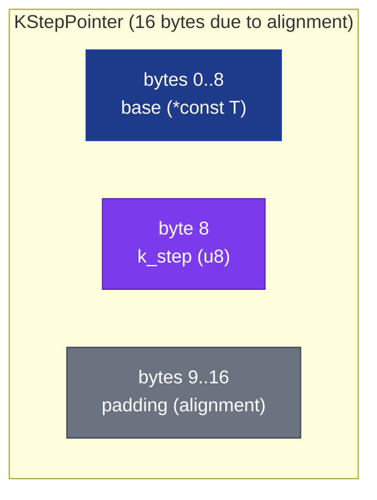

# KStepPointer&lt;T&gt; and StridedIter&lt;T&gt;


_%3C%3C_k__step-success)


A typed strided pointer that encodes the iteration stride as
`log2` (k_step: u8) instead of a runtime `usize`. The byte
stride between consecutive elements is
`size_of::<T>() << k_step`, one shift per pointer, and element
`i` sits `i * stride` bytes past the base; when `k_step` is known
at compile time the stride is a constant.

> **The "stride is a power-of-two shift" primitive.** Same
> architectural shape as BLAS row/column strides and NumPy
> strided arrays - but with the stride encoded as `k_step: u8`
> (log2-of-stride-multiplier), always a power-of-two multiple of
> the element size. The measured speed advantage over a stride
> read at run time is about 1% on a strided load loop.

**Constraints (read first):**

- **In-process only.** `base: *const T` is a real machine
  pointer, not portable across processes.
- **`new` and `tight` and `cache_line` are all `unsafe`.** The
  caller asserts `base` is valid and that every strided position
  `base + i * stride` stays in bounds for the indices the caller
  will visit.
- **`get(i)` is `unsafe`** and is unchecked. There is no
  bounds-test on `i`; out-of-range indices silently produce
  pointers past the array.
- **Stride is fixed at construction.** A single `KStepPointer`
  cannot adapt its stride mid-iteration. For variable-stride
  workloads (e.g. CSR sparse matrices with per-row strides) use
  a different abstraction.
- **`k_step` is a `u8`, but a shift of 64 or more overflows
  `usize`.** `stride()` and `at()` panic on it in debug builds and
  mask the shift amount in release builds. Usable values are those
  whose stride stays inside the allocation; `0..=12` covers tight
  packing through page-sized strides.
- **Iteration yields shared references.** `KStepPointer<T>`
  exposes `&T`; strided mutable access goes through the raw
  pointer `at(i)` gives back and the caller's own unsafe
  mutable deref.
- **Size is 16 bytes due to alignment.** The struct contains a
  pointer (8 bytes, 8-byte alignment) + u8 + PhantomData. Rust
  rounds up to 16 bytes for the next 8-byte boundary, so
  `KStepPointer<u64>` is twice the size of a bare pointer.
- **The measured gain is small.** On the bench host the typed path
  was 3% faster than a stride read at run time (74.7 ns against
  77.2 ns over 256 loads) and within noise of a compile-time
  constant stride.

---

## Table of contents

- [What it is](#what-it-is)
- [Why k_step (log2 stride)](#why-k_step-log2-stride)
- [Layout](#layout)
- [k_step values](#k_step-values)
- [API at a glance](#api-at-a-glance)
- [Worked example](#worked-example)
- [Benchmark results](#benchmark-results)
- [Use case patterns](#use-case-patterns)
- [Known limitations (verified)](#known-limitations-verified)
- [Common pitfalls](#common-pitfalls)

---

## What it is

`KStepPointer<T>` is a `(base, k_step)` pair:

```rust
pub struct KStepPointer<T> {
    base: *const T,
    k_step: u8,
    _phantom: PhantomData<*const T>,
}
```

The address of element `i` is computed as:

```rust
addr_i = base + ((i * size_of::<T>()) << k_step)
```

The `<< k_step` is the load-bearing piece: it's a single
SHL-with-immediate when `k_step` is propagated as a compile-time
constant.

`StridedIter<'a, T>` is the iterator companion:

```rust
pub struct StridedIter<'a, T> {
    ptr: KStepPointer<T>,
    i: usize,
    count: usize,
    _life: PhantomData<&'a T>,
}
```

Implements `Iterator<Item = &'a T>` and `ExactSizeIterator`.

## Why k_step (log2 stride)

The standard approach to strided iteration uses a runtime
`stride: usize`:

```rust
for i in 0..n {
    let p = unsafe { base.cast::<u8>().add(i * stride).cast::<T>() };
    consume(unsafe { &*p });
}
```

The offset is a multiply by a value the compiler cannot see, and
any stride is accepted, including one that splits an element.

With `KStepPointer`, the stride is encoded as `k_step: u8`
where the actual byte stride is `size_of::<T>() << k_step`:

```text
stride = size_of::<T>() << k_step
addr_offset = i * stride
load base + addr_offset
```

When the caller builds the pointer with a `k_step` the compiler
can see, the stride is a constant. The stride is
always a power-of-two multiple of `size_of::<T>()`, so an aligned
base gives aligned elements at every index.

## Layout


```mermaid
flowchart LR
    subgraph KP["KStepPointer (16 bytes due to alignment)"]
      direction LR
      B["bytes 0..8<br/>base (*const T)"]
      K["byte 8<br/>k_step (u8)"]
      P["bytes 9..16<br/>padding (alignment)"]
    end

    classDef ptr fill:#1e3a8a,stroke:#1e40af,color:#ffffff
    classDef k fill:#7c3aed,stroke:#5b21b6,color:#ffffff
    classDef pad fill:#6b7280,stroke:#374151,color:#ffffff
    class B ptr
    class K k
    class P pad
```

The 7 bytes of padding come from the `*const T` field's 8-byte
alignment.

## k_step values

| `k_step` | Stride (T = u64) | Stride (T = u8) | Use case |
|---:|---:|---:|---|
| 0 | 8 B | 1 B | Tight contiguous Vec / array |
| 1 | 16 B | 2 B | Every other element |
| 2 | 32 B | 4 B | Sub-quarter access |
| 3 | 64 B | 8 B | SIMD lane stride or cache-line for T=u64 |
| 6 | 512 B | 64 B | Cache-line stride for T=u8 |
| 12 | 32 KB | 4 KB | Page-aligned stride |

`KStepPointer::cache_line(base)` picks the smallest `k_step`
such that the stride is at least 64 bytes (one cache line),
selecting based on `size_of::<T>()`.

## API at a glance

<details open>
<summary><b>Construction</b></summary>

| Method | Signature | Notes |
|---|---|---|
| `new(base, k_step)` (unsafe) | `const unsafe fn(*const T, u8) -> Self` | Generic constructor |
| `tight(base)` (unsafe) | `const unsafe fn(*const T) -> Self` | `k_step = 0` (contiguous) |
| `cache_line(base)` (unsafe) | `const unsafe fn(*const T) -> Self` | Picks smallest `k_step` for stride >= 64 B |

</details>

<details open>
<summary><b>Inspection</b></summary>

| Method | Returns | Notes |
|---|---|---|
| `base()` | `*const T` | Raw base pointer |
| `k_step()` | `u8` | Encoded log2 stride multiplier |
| `stride()` | `usize` | `size_of::<T>() << k_step` |

</details>

<details open>
<summary><b>Access</b></summary>

| Method | Signature | Notes |
|---|---|---|
| `at(i)` (unsafe) | `unsafe fn(&self, usize) -> *const T` | Raw pointer to i-th element |
| `get(i)` (unsafe) | `unsafe fn(&self, usize) -> &T` | Borrow i-th element |
| `iter(count)` (unsafe) | `unsafe fn(&self, usize) -> StridedIter<'_, T>` | Iterator over `count` strided elements |

</details>

<details>
<summary><b>StridedIter&lt;T&gt;</b></summary>

| Trait | Notes |
|---|---|
| `Iterator<Item = &'a T>` | Yields strided references |
| `ExactSizeIterator` | Reports remaining count via `size_hint` |

</details>

## Worked example

```rust
use subetha_pointers::kstep_pointer::KStepPointer;

// 4x4 row-major matrix stored as a flat Vec<u64>. Each row is
// 4 elements * 8 bytes = 32 bytes. Walking column 0 means
// stride 32 bytes = sizeof(u64) << 2, so k_step = 2.
let matrix: Vec<u64> = (0..16u64).collect();
let col_0 = unsafe { KStepPointer::new(matrix.as_ptr(), 2) };
assert_eq!(col_0.stride(), 32);

// SAFETY: 4 strided positions at stride 32 = 96 bytes from
// matrix.as_ptr() = within the 128-byte allocation.
let column: Vec<u64> = unsafe { col_0.iter(4) }.copied().collect();
assert_eq!(column, vec![0, 4, 8, 12]);

// Cache-line stride: for u64, stride 64 = k_step 3. Walks every
// 8th element.
let cl = unsafe { KStepPointer::<u64>::cache_line(matrix.as_ptr()) };
assert_eq!(cl.k_step(), 3);
assert_eq!(cl.stride(), 64);

// Tight packing for default Vec iteration.
let tight = unsafe { KStepPointer::tight(matrix.as_ptr()) };
assert_eq!(tight.stride(), 8);  // sizeof(u64)
let all: Vec<u64> = unsafe { tight.iter(16) }.copied().collect();
assert_eq!(all, (0..16u64).collect::<Vec<_>>());
```

## Benchmark results

256 strided loads (1024-element matrix walked at stride 32).
Measured on Windows 11 Pro 10.0.26200 on an AMD Ryzen 9 7900X, built
for the x86-64 baseline, with Criterion's defaults (3 s warm-up, 100
samples over 5 s; middle estimate of each [low, mid, high] triple),
while other work kept 8.4 to 8.9 of the machine's 24 hardware threads
busy.

### Bench design

The runtime-stride contender sources its stride from a `Vec<usize>`
indexed by a `black_box`'d value, so the compiler cannot constant-fold
it. A local `let stride: usize = 32;` would be a constant the
compiler can see, like the typed k_step path, and a comparison with
it would measure the fold, not the pointer. A third contender,
`compile_const_stride_baseline`, keeps that compile-time-foldable case
visible for reference.

### Results

| Contender | Time | Per-step | Stride determination |
|---|---:|---:|---|
| `runtime_stride_usize` | 42.1 ns | ~0.16 ns | `Vec<usize>::index` at runtime, defeats compiler folding |
| **`compile_const_stride_baseline`** | **41.6 ns** | **~0.16 ns** | `const STRIDE: usize = 32` |
| `typed_k_step` (the primitive) | 41.6 ns | ~0.16 ns | `k_step = 2`, set where the compiler can see it |

The two compile-time-stride paths (`typed_k_step` and
`compile_const_stride_baseline`) are within measurement noise of
each other (41.56 ns vs 41.60 ns), and the run-time stride took
0.5 ns longer over the 256 loads, 1.01x. That is about 2 ps per
load, a small fraction of one cycle, so it is not a multiply per
step; the bench does not isolate what it is.

### What each contender computes

The typed path computes `base + i * (8 << 2)` with `k_step = 2`
set by `KStepPointer::new(base, 2)` in the same function. The
constant baseline computes `base + i * 32` with `STRIDE = 32` a
`const`. Both strides are known to the compiler, and the two run
at the same speed.

The runtime contender reads its stride from
`strides_table[black_box(1)]` once per timed iteration and uses it
for all 256 loads.

`k_step` does not force a compile-time stride: it is a `u8` field,
and `KStepPointer::new` accepts one computed at run time. What the
type does guarantee is the stride's shape, a power-of-two multiple
of `size_of::<T>()`.

## Use case patterns

<details>
<summary><b>Pattern 1: BLAS-style row / column matmul iteration</b></summary>

A 4x4 column-major matrix stored as `Vec<f64>` has row stride 4
elements * 8 bytes = 32 bytes. Walking each row uses
`KStepPointer<f64>` with `k_step = 2` (since
`sizeof(f64) << 2 = 32`). Walking each column uses
`KStepPointer<f64>` with `k_step = 0` (tight, since the column
is contiguous in column-major).

For row-major matrices, the strides flip: rows tight, columns
strided.

</details>

<details>
<summary><b>Pattern 2: AoS-to-SoA gathers need a power-of-two stride</b></summary>

An array-of-structures `Vec<Vec3>` where `Vec3 = (f32, f32, f32)`
has 12 bytes per element. Gathering just the x components needs
stride 12, which is 3 times `size_of::<f32>()` and not a power of
two, so no `k_step` expresses it. Use a runtime `stride: usize`
or pad the structure to 16 bytes, which `k_step = 2` covers.

</details>

<details>
<summary><b>Pattern 3: cache-line-stride prefetching</b></summary>

When walking a large array and intentionally touching every
cache line (e.g. to warm the cache or measure memory latency),
`KStepPointer::cache_line(base)` picks the right
`k_step` for the element size. For T=u64 it's `k_step=3`
(stride 64); for T=u8 it's `k_step=6` (also stride 64).

</details>

<details>
<summary><b>Pattern 4: a stride that cannot split an element</b></summary>

In a code base where stride values are passed around between
helpers, a `KStepPointer<T>` carries its stride as a power-of-two
multiple of `size_of::<T>()`, so no stride it holds lands between
elements or misaligns one.

A function taking `(base: *const T, stride: usize)` accepts any
byte stride, including one that is not a multiple of the element
size.

</details>

## Known limitations (verified)

1. **In-process only.** `base` is a raw machine pointer.

2. **All accessors are unsafe.** No bounds-check on `get(i)` or
   `at(i)`; out-of-range `i` silently produces invalid
   addresses.

3. **Stride is fixed at construction.** No mid-iteration stride
   changes. Variable-stride workloads (CSR sparse matrices,
   per-row strides) need a different abstraction.

4. **`k_step` encodes log2 strides only.** Non-power-of-2
   strides (e.g. 12 bytes for `Vec3`) cannot be represented;
   use runtime `stride: usize` for those.

5. **Size is 16 bytes due to alignment.** Twice the size of a
   bare pointer. For collections of strided pointers this
   doubles the storage cost vs raw `*const T`.

6. **Strided mutable access is hand-rolled.** It goes through
   `at(i) as *mut T` and the caller's own unsafe deref.

7. **The measured speed gain is 3-4%.** The bench host ran the
   typed path 1.03x faster than a stride read at run time, and
   the difference is far less than a multiply per step.

8. **`cache_line` caps `k_step` at 6.** For a zero-sized `T` it
   picks `k_step = 6` and the stride is 0: every index names the
   same address.

9. **Bench design (see above).** The runtime-stride contender
   uses a truly-runtime stride (not a compile-foldable constant),
   against which the typed path is ~1.03x faster (and within
   noise of the compile-const baseline).

10. **`StridedIter` goes forward only.** It does not implement
    `DoubleEndedIterator`; reverse iteration requires
    constructing a separate `KStepPointer` from the end of the
    array.

## Common pitfalls

<details>
<summary><b>Pitfall 1: out-of-bounds `get(i)`</b></summary>

```rust
let data: Vec<u64> = (0..10u64).collect();
let p = unsafe { KStepPointer::new(data.as_ptr(), 0) };
// SAFETY violation: i = 20 is past the array.
let v = unsafe { *p.get(20) };  // reads arbitrary memory
```

There is no bounds-test. The caller is responsible for
ensuring `i * stride` stays within the allocation.

</details>

<details>
<summary><b>Pitfall 2: non-power-of-2 stride</b></summary>

```rust
struct Vec3 { x: f32, y: f32, z: f32 }  // 12 bytes
let data: Vec<Vec3> = ...;
// SoA gather over .x with stride 12 bytes:
// `12 / sizeof(f32) = 3`, which is not a power of 2.
// You cannot pick a k_step that gives stride = 12 for T = f32.
```

Pad `Vec3` to 16 bytes (with `#[repr(C, align(16))]` and a
trailing `_pad: f32`) so stride 16 = `4 << 2` works, or use a
runtime stride.

</details>

<details>
<summary><b>Pitfall 3: holding the pointer past the borrow</b></summary>

```rust
let p = {
    let data: Vec<u64> = (0..10u64).collect();
    unsafe { KStepPointer::new(data.as_ptr(), 0) }
};  // data dropped here
// p.base is dangling.
unsafe { *p.get(0); }  // UB
```

`KStepPointer` doesn't carry a lifetime; the caller manages
target lifetime via the unsafe contract. To get borrow-checker
help, wrap the pointer in a struct that holds the source slice
borrow.

</details>

<details>
<summary><b>Pitfall 4: expecting a large speedup</b></summary>

The bench shows a 3-4% win over a truly-runtime stride on one x86
host. If your workload depends on a measurable speedup from typed
strides, profile on the target architecture first.

</details>

---

[back to subetha-pointers docs](../../)
