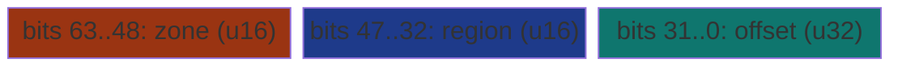
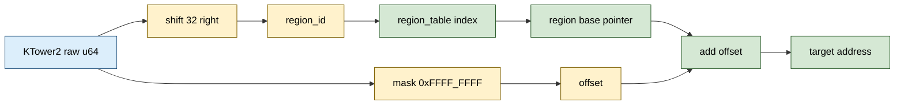

# KTower2&lt;T&gt; and KTower3&lt;T&gt;


Recursive pow2-of-pow2 address decomposition. A `KTower2<T>` is a
two-segment `(region_id: u32, offset: u32)` pair packed into a u64;
a `KTower3<T>` is a three-segment `(zone: u16, region: u16, offset:
u32)` packed into a u64. Resolution goes through a caller-supplied
region table. The pointer carries an INDEX, not a virtual address.
This is the userspace analog of the hardware MMU's page-table
indirection, lifted from physical pages to arbitrary regions.

> **The "userspace MMU" primitive.** Native 64-bit pointers address
> exactly one tier: the OS virtual address space. `KTower2` adds one
> level of indirection so the `region_id` can select a tier (RAM /
> SSD / remote / archive) and the `offset` selects within. Because
> both segments are indices, the pointer is byte-identical in every
> process that holds the same region tables. No relocation, no
> rebasing.

**Constraints (read first):**

- **Cross-process portable only when region tables agree.** Both
  segments are indices. Two processes resolve a `KTower2` to the
  same logical address if their region tables hold the same set of
  region base pointers in the same order. They will resolve to
  DIFFERENT machine addresses (each process maps the regions at its
  own VA), which is the entire point.
- **`resolve` is `unsafe`.** The caller asserts that `region_id` is
  a valid index into the supplied region table AND that the
  resulting `base + offset` is a valid `T`.
- **`resolve` reads `region_table[self.region_id() as usize]`
  unchecked.** Out-of-range region IDs trigger Rust's slice
  bounds-check panic. This is not UB but it is a runtime panic, so
  validate `region_id` against `table.len()` at the trust boundary
  if the input is untrusted.
- **Capacity ceiling per segment is pow2:** `KTower2` allows 2^32
  regions by 2^32 offset (16 EiB per region); `KTower3` allows
  2^16 zones by 2^16 regions by 2^32 offset.
- **`offset` is in BYTES, not in `T`.** The caller is responsible
  for stride. The `resolve` method does `base.add(offset)` then
  casts to `*const T`, so any alignment requirement of `T` must be
  satisfied by the offset value.
- **Region table holds `*const u8`.** All regions share one pointer
  type; per-region typing is the caller's responsibility (a single
  table cannot mix `*const u64` and `*const String` regions in
  type-safe form, only as `*const u8` casts).
- **No write path on the pointer.** `KTower2::resolve` returns
  `*const T`. For mutable resolution the caller writes their own
  unsafe `*mut T` cast from the same encoded form.
- **No drop semantics, no ownership.** `KTower2<T>` is `Copy` and
  `#[repr(transparent)]` over `u64`. It does NOT own the region
  table or the region storage.
- **`new` is safe and `const`.** Construction cannot fail. Any
  `(u32, u32)` pair is a valid encoding. Validity at resolve time
  depends on the region table.

---

## Table of contents

- [What it is](#what-it-is)
- [Why packed segments](#why-packed-segments)
- [Layout](#layout)
- [The recursive form](#the-recursive-form)
- [API at a glance](#api-at-a-glance)
- [Worked example](#worked-example)
- [Benchmark results](#benchmark-results)
- [Use case patterns](#use-case-patterns)
- [Known limitations (verified)](#known-limitations-verified)
- [Common pitfalls](#common-pitfalls)

---

## What it is

`KTower2<T>` is a single `u64` re-interpreted as two `u32` halves:

```rust
#[repr(transparent)]
pub struct KTower2<T> {
    raw: u64,
    _phantom: PhantomData<*const T>,
}
```

The `region_id` lives in the high 32 bits, the `offset` in the low
32 bits. Resolution computes the target address as:

```rust
addr = region_table[region_id] + offset
```

`KTower3<T>` is the same shape with a three-way segmentation:

```rust
#[repr(transparent)]
pub struct KTower3<T> {
    raw: u64,
    _phantom: PhantomData<*const T>,
}
```

with `zone: u16` in the highest 16 bits, `region: u16` in the next
16, and `offset: u32` in the low 32. Resolution adds one more
indirection layer (zone_table -> region_table -> offset), making
`KTower3` the equivalent of two MMU page-table levels packed into
one word.

Both variants are 8 bytes total. Same slot size as a native
pointer, but the address space is now multi-segment AND
position-independent (because every segment is an INDEX, not a
virtual address).

---

## Why packed segments

A bare `*const T` is one segment: the OS virtual address space.
Once you want more than one segment, you have three encoding
choices:

| Encoding | Size | Resolve cost | Cross-process? |
|---|---|---|---|
| `(*const u8, u32)` struct | 16 bytes | 1 add + 1 deref | NO (raw VA inside) |
| `(u32, u32)` tuple + region table | 8 bytes | 1 table load + 1 add + 1 deref | YES |
| `KTower2<T>` (u64 packed) + region table | 8 bytes | 1 table load + 1 add + 1 deref | YES |

The bottom two rows do logically the same thing. The packing into
a `u64` was expected to help codegen (a `#[repr(transparent)] u64`
loads in one 8-byte read, then shift-and-mask splits the segments),
but the [benchmark](#benchmark-results) on this host shows the
opposite: the shift+mask cost more than two adjacent `u32` loads
from the tuple, so the tuple was ~1.31x faster. The packed form's
real, host-independent benefit is that it is a single `u64` value
(trivially `Copy`, one word in registers and in shared rings), not
a guaranteed per-lookup speedup.

`✶ Insight ────────────────────────────────`

The "userspace MMU" framing is load-bearing. Hardware MMU pages
have a 1-level (4 KiB), 2-level (2 MiB), or 4-level (variable)
walk depth chosen by the kernel per workload: hot dense data
gets short walks, cold sparse data gets deep walks. `KTower2`
plus `KTower3` give the same dial in userspace: one level of
indirection for medium workloads, two levels for distributed
storage. The recursive form (see below) extends this to
arbitrary depth at the cost of one table lookup per level.

`──────────────────────────────────────────`

---

## Layout

**KTower2** layout (8 bytes, packed u64):


**KTower3** layout (8 bytes, packed u64):



Both:

- `#[repr(transparent)]` over `u64`. `Vec<KTower2<T>>` has the
  same layout as `Vec<u64>`.
- Construction by `const fn new(...)`. Packing is just shifts and
  ORs; no allocation, no failure path.
- Accessors `region_id()`, `offset()`, `zone()`, `region()` are
  all `const fn` returning extracted segments.



---

## The recursive form

The variants `KTower2` and `KTower3` are the SHIPPED base cases of
a broader recursion:

```text
KTower2<T>      = (region_id: u32, offset: u32)
                = (KTower2<RegionTable<T>>, u32)            -- recursive
                = KTower2<KTower2<KTower2<KTower2<T>>>>    -- 4 levels
```

At each level `N`, the `region_id` indexes into a TABLE OF
`KTower2` pointers at level `N-1`. At the leaf (level 0), the
`offset` is the actual byte offset within a physical region. The
recursion depth is a runtime / type-level choice:

- **Shallow tower (depth 1):** dense address spaces, fast lookup.
  This is what `KTower2` ships today.
- **Medium tower (depth 2):** hierarchical naming. `KTower3` ships
  this for zone -> region -> offset.
- **Deep tower (depth 4):** very sparse address spaces, minimal
  storage for empty regions. The crate does NOT ship a
  general-depth `KTowerCascade` today; that lives in the
  recursive form as a build-on-top-of-base-case option.

---

## API at a glance

```rust
// Construction
let p: KTower2<u64> = KTower2::new(region_id, offset);
let p3: KTower3<u64> = KTower3::new(zone, region, offset);

// Accessors (all const)
let r = p.region_id();
let o = p.offset();
let raw = p.raw();

// Resolution (unsafe: caller asserts region_id valid + base+offset
// is a valid T)
let region_table: Vec<*const u8> = vec![/* per-region bases */];
let target: *const u64 = unsafe { p.resolve(&region_table) };
let value: u64 = unsafe { *target };
```

`KTower3` exposes `zone()`, `region()`, `offset()`, `raw()` but
does NOT ship a `resolve` method today. The multi-level table
indirection is delegated to the caller (the caller picks how to
build the zone -> region table walk).

---

## Worked example

A two-region setup with regions mapped to different storage
tiers. The same `KTower2` encoding resolves through both:

```rust
use subetha_pointers::k_tower_pointer::KTower2;

// Two regions: "hot" (RAM-backed Vec) and "warm" (SSD-mmap'd file,
// modelled here as a Vec for the example).
let region_hot:  Vec<u64> = vec![10, 20, 30, 40];
let region_warm: Vec<u64> = vec![100, 200, 300, 400];

// Region table: indices map to base pointers.
let table: Vec<*const u8> = vec![
    region_hot.as_ptr()  as *const u8,
    region_warm.as_ptr() as *const u8,
];

// Logical address: "region 1, byte offset 8" -> second u64 in
// region_warm. The pointer carries indices only; the resolve walk
// happens through the table.
let p: KTower2<u64> = KTower2::new(1, 8);
let v = unsafe { *p.resolve(&table) };
assert_eq!(v, 200);

// The SAME bytes (region_id=1, offset=8) can be sent to another
// process. As long as that process holds a table with the warm
// region at index 1, the same KTower2 resolves to the same logical
// element, even though the physical base pointer differs.
```

The encoded form is 8 bytes. The 16-byte equivalent would be a
`(*const u8, u32)` struct carrying the real RAM address, which
loses cross-process portability AND doubles the storage cost.

---

## Benchmark results

Bench: `crates/subetha-pointers/benches/hybrid_pointers.rs`,
function `ktower_resolve`. Three contenders measured against a
1 024-entry workload spread across 8 regions of 1 024 u64s each.
Measured on Windows 11 / Zen+ R7 2700, criterion at
`--measurement-time 2 --warm-up-time 1 --sample-size 30` (middle
estimate of each [low, mid, high] triple).

| Contender | Time | Cost vs floor | Ops in body |
|---|---|---|---|
| `hybrid.ktower/direct_ptr_1024` (pre-resolved `*const u64`) | **734 ns** | 1.00x (floor) | 1 load |
| `hybrid.ktower/native_struct_resolve_1024` (raw `(u32, u32)` tuple) | **1.98 us** | 2.70x | 1 tuple load + 1 table load + 1 add + 1 load |
| `hybrid.ktower/resolve_1024` (KTower2 API) | **2.60 us** | 3.55x | 1 table load + 1 shift + 1 mask + 1 add + 1 load |

**The benchmark includes a `native_struct_resolve` contender, not
just the zero-indirection `direct_ptr`.** Comparing KTower only against
`direct_ptr` is a surplus-indirection asymmetry: KTower pays for the
table lookup while that contender does not. The native `(u32, u32)`
struct contender does the SAME table lookup + offset add + deref,
isolating the encoding cost from the indirection cost - the honest
3-way comparison the table above reports.

**Reading the results on this host:**

- **One indirection costs ~2.7-3.6x a pre-resolved pointer.** That
  is the price of cross-process portability and tiered-storage
  addressing: no encoding that carries a region index can pay less
  than one table lookup + one add.
- **The native `(u32, u32)` tuple is FASTER than the KTower2 API
  here, by ~1.31x** (1.98 us vs 2.60 us) - the opposite of the
  packed-u64 "cleaner codegen" expectation. On this CPU /
  toolchain the shift+mask the packed form adds (to split the u64
  into region_id and offset) costs more than reading two adjacent
  `u32`s from the tuple. The "packed u64 wins on codegen" claim
  does NOT reproduce on Zen+; treat KTower2's value as the
  position-independent / cross-process encoding, not a per-lookup
  speedup over an equivalent tuple. Re-run on the target hardware
  before assuming either ordering.
- **Per-entry cost** of the KTower path is ~2.54 ns/lookup
  (2.60 us / 1024 entries); the native tuple is ~1.94 ns; the
  pre-resolved floor is ~0.72 ns. The two-hop walk sits a couple
  of nanoseconds above a single cache-resident load.

**When the direct_ptr floor is the right baseline:** when the
caller has already paid the table lookup once and is iterating
over a hot region many times. Pre-resolve to `*const T` and
iterate (~734 ns here).

**When the KTower path is the right baseline:** when the caller is
iterating over many different regions, or when the encoded form
needs to cross a process boundary, or when the region table might
rebind underneath (storage hot-swap) - i.e. when
position-independence is the requirement, accepting the ~2.60 us
two-hop cost.

---

## Use case patterns

| Pattern | Use `KTower2` for | Why |
|---|---|---|
| **Tiered storage addressing** | Distinct `region_id` per tier (RAM=0, SSD=1, remote=2) | The dispatch table for "load from this pointer" branches on `region_id`; no need to mark the tier in the high pointer bits. |
| **Cross-process shared encoding** | Region bases at known table slots; pointers in shared rings | The pointer travels by value; each process resolves through its own region table. |
| **Userspace virtual memory** | Map region_id 0..255 to allocation arenas | Compaction (moving a region) only requires updating one table slot; every encoded pointer reading that region picks up the new base. |
| **Tagged pointer alternative** | When you've run out of tag bits in a 64-bit pointer | `KTower2` gives you a clean 32-bit tag (the region_id) at the cost of a table lookup. |
| **Distributed storage naming** (`KTower3`) | Zone -> region -> offset hierarchical lookups | The zone selects rack / DC, region selects node, offset selects slot. Three levels of MMU-style indirection in one word. |

---

## Known limitations (verified)

These have all been confirmed by reading the source or running
the bench:

- **`KTower3::resolve` is not shipped.** `KTower3` defines only
  `new` / `zone` / `region` / `offset` / `raw` accessors; the
  two-level walk is the caller's responsibility today.
- **Resolution panics on out-of-range `region_id`.**
  `KTower2::resolve` indexes `region_table[self.region_id() as
  usize]`, an ordinary slice index. Out-of-range hits an
  `index_out_of_bounds` panic. This is documented as a Safety
  constraint in the rustdoc.
- **No `KTower2Mut` for mutable resolution.** The shipped API
  returns `*const T`. Callers needing `*mut T` cast it themselves
  from the same encoded form.
- **Per-segment ceilings are baked in.** `KTower2`: 4 G regions by
  4 GiB / region. `KTower3`: 64 K zones by 64 K regions / zone by
  4 GiB / region. These cover virtually any realistic deployment
  but are not parameterized.
- **No general-depth `KTowerCascade`.** The recursive form is
  described in the source rustdoc but only the 2-segment and
  3-segment base cases ship. Building a 4-level cascade is the
  caller's job today (compose `KTower2` of `KTower2`).
- **Codegen of the u64-packed form is not a guaranteed win.** On
  the measured Windows x86_64 / Zen+ build the packed encoding was
  ~1.31x SLOWER than the native `(u32, u32)` tuple (the shift+mask
  to split the u64 cost more than two adjacent u32 loads). The
  ordering is host- and toolchain-dependent; KTower2's durable
  value is position-independence and cross-process portability,
  not a per-lookup speedup over an equivalent tuple. Benchmark on
  the target hardware before assuming either is faster.

---

## Common pitfalls

- **Don't store a raw VA in `offset`.** `offset` is a byte offset
  from a region base. Storing a virtual address there defeats the
  cross-process portability guarantee. At that point you'd be
  better off with a `(*const T, ...)` struct.
- **Don't share a `region_table` across processes by reference.**
  Each process builds its own table. The pointers travel; the
  tables don't. This is the same invariant the kernel enforces
  for page tables: every process has its own.
- **Don't change a region's base mid-iteration.** If the caller is
  iterating `for p in pointers { p.resolve(&table) }` and another
  thread rebinds `table[i]`, the iterator may resolve some
  pointers to the OLD base and some to the new one. Use a read
  lock or a generation counter to detect rebinds.
- **Don't forget alignment.** `offset` is in bytes; `*const T`
  must satisfy `T`'s alignment. If `T` is `u64` (8-byte aligned),
  offsets must be multiples of 8. The `resolve` method does NOT
  check.
- **Don't pack a `region_id` from untrusted input without
  bounds-checking.** The `new` constructor accepts any `u32`;
  passing a `region_id` that exceeds the table size will panic at
  resolve time. Validate at the trust boundary.
- **Don't confuse `KTower2<T>` with `*const T`.** They are the
  same size but the encoded form is NOT a valid machine address.
  Passing `p.raw() as *const T` to anything that wants a real
  pointer will segfault.

---
