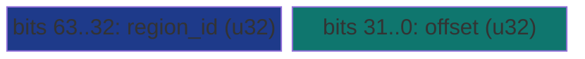
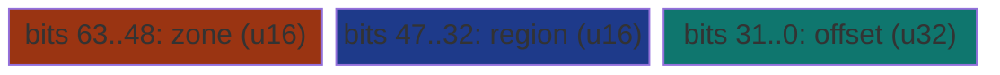
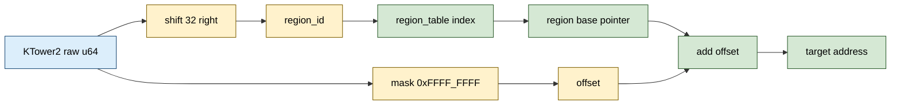

# KTower2&lt;T&gt; and KTower3&lt;T&gt;


Segmented addresses in one `u64`. A `KTower2<T>` packs a
`(region_id: u32, offset: u32)` pair and resolves through a region
table the caller supplies; a `KTower3<T>` packs `(zone: u16, region:
u16, offset: u32)` and leaves the two-table walk to the caller. The
pointer carries indices, not a virtual address. The hardware MMU
resolves addresses the same way, through nested tables of indices;
these types apply that indirection to arbitrary regions instead of
physical pages.

> **The "userspace MMU" primitive.** A native 64-bit pointer
> addresses one space, the process's virtual memory. `KTower2` adds
> one level of indirection, so `region_id` selects a region (a heap
> block, a mapped file) and `offset` selects a byte within it.
> Because both segments are indices, the pointer is byte-identical
> in every process whose table lists the same regions in the same
> order. No relocation, no rebasing.

**Constraints (read first):**

- **Cross-process portable only when region tables agree.** Both
  segments are indices. Two processes resolve a `KTower2` to the
  same logical address if their region tables list the same regions
  in the same order. Each process maps the regions at its own
  addresses, so the machine addresses differ while the logical
  address agrees.
- **`resolve` is `unsafe`.** The caller asserts that `region_id` is
  a valid index into the supplied region table and that the
  resulting `base + offset` is a valid `T`.
- **`resolve` indexes `region_table[self.region_id() as usize]`
  with an ordinary slice index.** An out-of-range region id panics
  instead of reading out of bounds, so validate `region_id` against
  `table.len()` at the trust boundary if the input is untrusted.
- **Capacity ceiling per segment is pow2:** `KTower2` allows 2^32
  regions of 2^32 bytes each (4 GiB per region); `KTower3` allows
  2^16 zones by 2^16 regions by 2^32 bytes.
- **`offset` is in bytes, not in `T`.** The caller is responsible
  for stride. The `resolve` method does `base.add(offset)` then
  casts to `*const T`, so any alignment requirement of `T` must be
  satisfied by the offset value.
- **Region table holds `*const u8`.** All regions share one pointer
  type; per-region typing is the caller's responsibility (a single
  table cannot mix `*const u64` and `*const String` regions in
  type-safe form, only as `*const u8` casts).
- **No write path on the pointer.** `KTower2::resolve` returns
  `*const T`. Writing through it after a cast to `*mut T` is sound
  only when the table's base pointers came from mutable access to
  the regions (`as_mut_ptr`, a writable mapping).
- **No drop semantics, no ownership.** `KTower2<T>` is `Copy` and
  `#[repr(transparent)]` over `u64`. It does not own the region
  table or the region storage.
- **`new` is safe and `const`.** Construction cannot fail. Any
  `(u32, u32)` pair is a valid encoding. Validity at resolve time
  depends on the region table.

---

## Table of contents

- [What it is](#what-it-is)
- [Why packed segments](#why-packed-segments)
- [Layout](#layout)
- [Deeper towers](#deeper-towers)
- [API at a glance](#api-at-a-glance)
- [Worked example](#worked-example)
- [Benchmark results](#benchmark-results)
- [Use case patterns](#use-case-patterns)
- [Known limitations (verified)](#known-limitations-verified)
- [Common pitfalls](#common-pitfalls)

---

## What it is

`KTower2<T>` is a single `u64` re-interpreted as two `u32` halves:

```rust
#[repr(transparent)]
pub struct KTower2<T> {
    raw: u64,
    _phantom: PhantomData<*const T>,
}
```

The `region_id` lives in the high 32 bits, the `offset` in the low
32 bits. Resolution computes the target address as:

```rust
addr = region_table[region_id] + offset
```

`KTower3<T>` is the same shape with a three-way segmentation:

```rust
#[repr(transparent)]
pub struct KTower3<T> {
    raw: u64,
    _phantom: PhantomData<*const T>,
}
```

with `zone: u16` in the highest 16 bits, `region: u16` in the next
16, and `offset: u32` in the low 32. The caller resolves it through
two tables, zone table to region table to offset, the equivalent of
two page-table levels in one word. `KTower3` itself packs and
unpacks the fields and has no `resolve`.

Both variants are 8 bytes total. Same slot size as a native
pointer, but the address space is now multi-segment and
position-independent (because every segment is an index, not a
virtual address).

---

## Why packed segments

A bare `*const T` is one segment: the OS virtual address space.
Once you want more than one segment, you have three encoding
choices:

| Encoding | Size | Resolve cost | Cross-process? |
|---|---|---|---|
| `(*const u8, u32)` struct | 16 bytes | 1 add + 1 deref | no (raw VA inside) |
| `(u32, u32)` tuple + region table | 8 bytes | 1 table load + 1 add + 1 deref | yes |
| `KTower2<T>` (u64 packed) + region table | 8 bytes | 1 table load + 1 add + 1 deref | yes |

The bottom two rows do the same work. On the measured host the
tuple was ~1.31x faster than the packed form: splitting the `u64`
with a shift and a mask cost more than loading two adjacent `u32`s
(see the [benchmark](#benchmark-results)). The packed form's
benefit is that it is one `u64` value: `Copy`, one register, one
slot in a shared ring. It is not a per-lookup speedup.

---

## Layout

**KTower2** layout (8 bytes, packed u64):


```mermaid
block-beta
  columns 2
  r["bits 63..32: region_id (u32)"] o["bits 31..0: offset (u32)"]
  classDef regC fill:#1e3a8a,color:#ffffff
  classDef offC fill:#0f766e,color:#ffffff
  class r regC
  class o offC
```

**KTower3** layout (8 bytes, packed u64):


```mermaid
block-beta
  columns 3
  z["bits 63..48: zone (u16)"] r["bits 47..32: region (u16)"] o["bits 31..0: offset (u32)"]
  classDef zoneC fill:#9a3412,color:#ffffff
  classDef regC fill:#1e3a8a,color:#ffffff
  classDef offC fill:#0f766e,color:#ffffff
  class z zoneC
  class r regC
  class o offC
```

Both:

- `#[repr(transparent)]` over `u64`. `Vec<KTower2<T>>` has the
  same layout as `Vec<u64>`.
- Construction by `const fn new(...)`. Packing is just shifts and
  ORs; no allocation, no failure path.
- Accessors `region_id()`, `offset()`, `zone()`, `region()` are
  all `const fn` returning extracted segments.


```mermaid
flowchart LR
    A[KTower2 raw u64] --> B[shift 32 right]
    A --> C[mask 0xFFFF_FFFF]
    B --> D[region_id]
    C --> E[offset]
    D --> F[region_table index]
    F --> G[region base pointer]
    G --> H[add offset]
    E --> H
    H --> I[target address]
    classDef pack fill:#dceefb,stroke:#1f4e79,color:#000
    classDef extract fill:#fff2cc,stroke:#7f6000,color:#000
    classDef resolve fill:#d5e8d4,stroke:#2d5d2d,color:#000
    class A pack
    class B,C,D,E extract
    class F,G,H,I resolve
```

---

## Deeper towers

`KTower2` is one table level and `KTower3` is two. For more levels,
[`subetha_cxc::KTowerCascade<T, DEPTH>`](../../subetha-cxc/coordination-types/k-tower-cascade.md)
holds `DEPTH` `u32` indices and resolves them through `DEPTH` shared
regions: each intermediate slot stores the next level's index, which
the walk checks, and the leaf slot stores the `T`. At `DEPTH` = 4 it
has the shape of the x86-64 page walk (PML4, PDPT, PD, PT). Each
process opens the shared regions by path, so the caller keeps no
table of raw base pointers.

---

## API at a glance

```rust
// Construction
let p: KTower2<u64> = KTower2::new(region_id, offset);
let p3: KTower3<u64> = KTower3::new(zone, region, offset);

// Accessors (all const)
let r = p.region_id();
let o = p.offset();
let raw = p.raw();

// Resolution (unsafe: caller asserts region_id valid + base+offset
// is a valid T)
let region_table: Vec<*const u8> = vec![/* per-region bases */];
let target: *const u64 = unsafe { p.resolve(&region_table) };
let value: u64 = unsafe { *target };
```

`KTower3` exposes `zone()`, `region()`, `offset()` and `raw()`.
The zone -> region table walk is the caller's, which is what lets
the caller choose how those tables are laid out and reached.

---

## Worked example

A two-region setup with regions mapped to different storage
tiers. The same `KTower2` encoding resolves through both:

```rust
use subetha_pointers::k_tower_pointer::KTower2;

// Two regions: "hot" (RAM-backed Vec) and "warm" (SSD-mmap'd file,
// modeled here as a Vec for the example).
let region_hot:  Vec<u64> = vec![10, 20, 30, 40];
let region_warm: Vec<u64> = vec![100, 200, 300, 400];

// Region table: indices map to base pointers.
let table: Vec<*const u8> = vec![
    region_hot.as_ptr()  as *const u8,
    region_warm.as_ptr() as *const u8,
];

// Logical address: "region 1, byte offset 8" -> second u64 in
// region_warm. The pointer carries indices only; the resolve walk
// happens through the table.
let p: KTower2<u64> = KTower2::new(1, 8);
let v = unsafe { *p.resolve(&table) };
assert_eq!(v, 200);

// The same bytes (region_id=1, offset=8) can be sent to another
// process. As long as that process holds a table with the warm
// region at index 1, the same KTower2 resolves to the same logical
// element, even though the physical base pointer differs.
```

The encoded form is 8 bytes. The 16-byte equivalent would be a
`(*const u8, u32)` struct carrying the real RAM address, which
loses cross-process portability and doubles the storage cost.

---

## Benchmark results

Bench: `crates/subetha-pointers/benches/hybrid_pointers.rs`,
function `ktower_resolve`. Three contenders measured against a
1 024-entry workload spread across 8 regions of 1 024 u64s each.
Measured on Windows 11 / Zen+ R7 2700, criterion at
`--measurement-time 2 --warm-up-time 1 --sample-size 30` (middle
estimate of each [low, mid, high] triple).

| Contender | Time | Cost vs floor | Ops in body |
|---|---|---|---|
| `hybrid.ktower/direct_ptr_1024` (pre-resolved `*const u64`) | **734 ns** | 1.00x (floor) | 1 load |
| `hybrid.ktower/native_struct_resolve_1024` (raw `(u32, u32)` tuple) | **1.98 us** | 2.70x | 1 tuple load + 1 table load + 1 add + 1 load |
| `hybrid.ktower/resolve_1024` (KTower2 API) | **2.60 us** | 3.55x | 1 table load + 1 shift + 1 mask + 1 add + 1 load |

The `native_struct_resolve` contender does the same table load,
offset add and load as `resolve`, from a plain `(u32, u32)` tuple.
The gap between those two rows is the cost of the encoding alone;
the gap to `direct_ptr` is the cost of the indirection.

**Reading the results:**

- **One indirection costs ~2.7-3.6x a pre-resolved pointer.** That
  is the price of cross-process portability and tiered-storage
  addressing: no encoding that carries a region index can pay less
  than one table lookup + one add.
- **The native `(u32, u32)` tuple is ~1.31x faster than the
  KTower2 API here** (1.98 us against 2.60 us). On this CPU and
  toolchain the shift and mask that split the packed `u64` into
  `region_id` and `offset` cost more than reading two adjacent
  `u32`s from the tuple. KTower2's value is the
  position-independent, one-word encoding, not a per-lookup
  speedup over an equivalent tuple. The ordering depends on host
  and toolchain, so measure on the target before relying on
  either.
- **Per-entry cost** of the KTower path is ~2.54 ns/lookup
  (2.60 us / 1024 entries); the native tuple is ~1.94 ns; the
  pre-resolved floor is ~0.72 ns. The two-hop walk sits a couple
  of nanoseconds above a single cache-resident load.

**When the direct_ptr floor is the right baseline:** when the
caller has already paid the table lookup once and is iterating
over a hot region many times. Pre-resolve to `*const T` and
iterate (~734 ns here).

**When the KTower path is the right baseline:** when the caller is
iterating over many different regions, or when the encoded form
needs to cross a process boundary, or when the region table might
rebind underneath (storage hot-swap) - i.e. when
position-independence is the requirement, accepting the ~2.60 us
two-hop cost.

---

## Use case patterns

| Pattern | Use `KTower2` for | Why |
|---|---|---|
| **Tiered storage addressing** | Distinct `region_id` per tier (heap = 0, mapped file = 1) | The caller reads the tier from `region_id()` without spending tag bits in the address. |
| **Cross-process shared encoding** | Region bases at known table slots; pointers in shared rings | The pointer travels by value; each process resolves through its own region table. |
| **Userspace virtual memory** | Map region_id 0..255 to allocation arenas | Compaction (moving a region) only requires updating one table slot; every encoded pointer reading that region picks up the new base. |
| **Tagged pointer alternative** | When you've run out of tag bits in a 64-bit pointer | `KTower2` gives you a clean 32-bit tag (the region_id) at the cost of a table lookup. |
| **Distributed storage naming** (`KTower3`) | Zone -> region -> offset hierarchical lookups | The zone selects rack / DC, region selects node, offset selects slot. Two table levels and an offset in one word. |

---

## Known limitations (verified)

These have all been confirmed by reading the source or running
the bench:

- **`KTower3` is accessors only.** It defines `new` / `zone` /
  `region` / `offset` / `raw`, and the two-level walk from zone to
  region to target belongs to the caller.
- **Resolution panics on out-of-range `region_id`.**
  `KTower2::resolve` indexes `region_table[self.region_id() as
  usize]`, an ordinary slice index. Out-of-range hits an
  `index_out_of_bounds` panic. This is documented as a Safety
  constraint in the rustdoc.
- **Resolution returns `*const T`.** A caller needing `*mut T`
  casts it from the same encoded form.
- **Per-segment ceilings are fixed by the encoding.** `KTower2`:
  4 G regions by 4 GiB / region. `KTower3`: 64 K zones by 64 K
  regions / zone by 4 GiB / region. They are not parameters.
- **Two table levels at most in this crate.** Deeper towers are
  `subetha_cxc::KTowerCascade<T, DEPTH>`, which resolves through
  shared regions rather than a table of raw pointers.
- **Codegen of the u64-packed form is not a guaranteed win.** On
  the measured Windows x86_64 / Zen+ build the packed encoding was
  ~1.31x slower than the native `(u32, u32)` tuple (the shift and
  mask that split the u64 cost more than two adjacent u32 loads).
  The ordering depends on host and toolchain.

---

## Common pitfalls

- **Don't store a raw VA in `offset`.** `offset` is a byte offset
  from a region base. Storing a virtual address there defeats the
  cross-process portability guarantee. At that point you'd be
  better off with a `(*const T, ...)` struct.
- **Don't share a `region_table` across processes by reference.**
  Each process builds its own table. The pointers travel; the
  tables don't. This is the same invariant the kernel enforces
  for page tables: every process has its own.
- **Don't change a region's base mid-iteration.** If the caller is
  iterating `for p in pointers { p.resolve(&table) }` and another
  thread rebinds `table[i]`, the iterator may resolve some
  pointers to the old base and some to the new one. Publish a new
  table instead of rebinding a slot in place, or check a generation
  counter around the walk to detect a rebind.
- **Don't forget alignment.** `offset` is in bytes; `*const T`
  must satisfy `T`'s alignment. If `T` is `u64` (8-byte aligned),
  offsets must be multiples of 8. The `resolve` method does not
  check.
- **Don't pack a `region_id` from untrusted input without
  bounds-checking.** The `new` constructor accepts any `u32`;
  passing a `region_id` that exceeds the table size will panic at
  resolve time. Validate at the trust boundary.
- **Don't confuse `KTower2<T>` with `*const T`.** They are the
  same size but the encoded form is not a machine address.
  Dereferencing `p.raw() as *const T` is undefined behavior.

---
