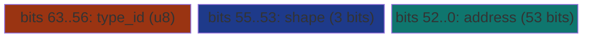
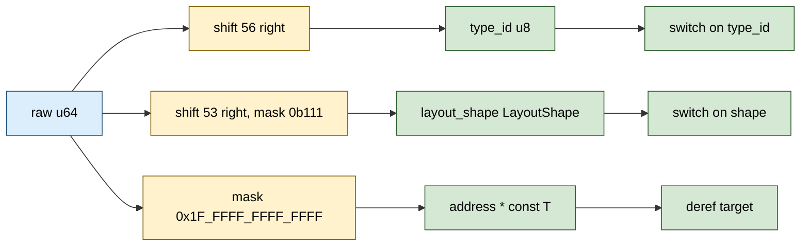

# SelfDescPointer&lt;T&gt;


A pointer that carries its own `(type_id, layout_shape)` description
in the stolen high bits of an 8-byte slot. Heterogeneous containers
dispatch on type WITHOUT a vtable indirection: the type ID is the
high byte, and the switch compiles to a jump table inline at the
call site. Same shape as JVM compressed-klass pointers but lighter
weight: 8 bits of type plus 3 bits of layout shape, leaving 53 bits
for the virtual address.

> **The "type tag in the pointer" primitive.** Rust's idiomatic
> options for heterogeneous containers are `Box<dyn Trait>`
> (unbounded type universe, vtable cost), `enum` (closed but pays
> discriminant + payload overhead), and inline tagging. When the
> type universe is bounded at 256 and the dispatch site is hot,
> the byte switch on the pointer's high bits beats vtable
> dispatch by ~3x and enum dispatch by ~1.4x.

**Constraints (read first):**

- **53-bit address envelope.** The low 53 bits of the u64 carry the
  address. Canonical x86_64 addresses use 48 bits, Apple Silicon
  up to 47; current commodity hardware has plenty of headroom. The
  cap is 8 PiB virtual.
- **`from_raw` is `unsafe`.** Caller asserts target validity for
  the pointer's lifetime.
- **The address assertion is `debug_assert!`, not `assert!`.**
  `from_raw` debug-asserts `addr & !ADDR_MASK == 0`; release
  builds will silently corrupt the `type_id` field if the input
  pointer's high bits are nonzero. Validate at the trust boundary
  if your allocator can return pointers above 8 PiB.
- **256-type ceiling.** `type_id: u8` covers 256 distinct types.
  Wider universes need `Box<dyn Trait>`, an enum, or a more
  elaborate encoding (sharded by layout shape, hierarchical IDs).
- **8 shape values exhausted.** `LayoutShape` is 3 bits encoding
  8 shapes: Scalar, FixedArray, RaggedArray, Tree, Graph,
  HashBucket, Sparse, UserDefined. `UserDefined` is the escape
  hatch for caller-specific extensions but only ONE value.
- **No drop semantics.** `SelfDescPointer<T>` is `Copy`; it does
  NOT own the target.
- **In-process only.** The address is a real virtual address.
  Cross-process sharing needs composition with a region-table
  primitive (e.g. `KTower2`) or address relocation.
- **`set_type_id` and `set_layout_shape` are safe and atomic per-
  field.** Either field can be updated without touching the other;
  the address survives the update. There is no method to update
  the address (would require a new `from_raw`).
- **Layout dispatch is the caller's job.** The pointer carries the
  `LayoutShape` byte but does NOT change how the target is laid
  out. The caller's dispatch table (one per shape) is what makes
  the shape useful.

---

## Table of contents

- [What it is](#what-it-is)
- [Why a tag in the pointer](#why-a-tag-in-the-pointer)
- [Layout](#layout)
- [LayoutShape values](#layoutshape-values)
- [API at a glance](#api-at-a-glance)
- [Worked example](#worked-example)
- [Benchmark results](#benchmark-results)
- [Use case patterns](#use-case-patterns)
- [Known limitations (verified)](#known-limitations-verified)
- [Common pitfalls](#common-pitfalls)

---

## What it is

`SelfDescPointer<T>` is a single `u64` with three packed fields:

```rust
#[repr(transparent)]
pub struct SelfDescPointer<T> {
    raw: u64,
    _phantom: PhantomData<*const T>,
}
```

The high byte holds the type ID, the next 3 bits hold the layout
shape, and the low 53 bits hold the virtual address:



Construction packs the fields with shifts and ORs. Access reads
the field via shift + mask. There is no allocation; the entire
type descriptor lives in the pointer slot.

---

## Why a tag in the pointer

Heterogeneous containers in Rust face three established options:

| Mechanism | Per-call cost | Type universe | Notes |
|---|---|---|---|
| `Arc<dyn Trait>` | atomic + indirect call | unbounded | Real-world shared-ownership shape. |
| `Box<dyn Trait>` | indirect call via vtable | unbounded | Single-owner; no atomic overhead. |
| `enum` | tag-load + match | closed | Idiomatic; pays discriminant + payload cost per slot. |
| `SelfDescPointer<T>` | one u64 load + shift + match | <= 256 | Closed universe + zero indirection. |

The `dyn Trait` path goes through a vtable: the compiler cannot
inline the called method because the function pointer is loaded
from the vtable at runtime. The `enum` path forces the compiler
to align all variants to the largest payload (so a vec of mixed
small + large variants pays the large variant's size per slot).

`SelfDescPointer` keeps the type universe closed (the
architectural commitment that all participating types are known
at compile time) but takes the byte-switch path: the compiler
sees a `match p.type_id() { 1 => ..., 2 => ..., 3 => ... }` and
emits a jump table on the high byte of the u64. No indirect
call, no oversized payload, no per-element memory allocation
beyond the 8-byte slot.

`✶ Insight ────────────────────────────────`

The CPU branch predictor handles a small switch on a u8
extremely well: it sees the pattern at the dispatch site and
the type ID stays in registers throughout the loop body. A
vtable dispatch defeats this by going through memory the
predictor cannot pre-resolve. The enum dispatch is in between:
the discriminant is also in the slot, but the slot is larger
(payload-aligned) so cache pressure is higher. The bench in
this doc shows the gradient explicitly: byte switch 817 ns,
enum 1.16 us, then the two `dyn Trait` shapes in the same band
(Arc<dyn> 2.45 us, Box<dyn> 2.77 us).

`──────────────────────────────────────────`

---

## Layout



`#[repr(transparent)] u64`: `Vec<SelfDescPointer<T>>` has the same
layout as `Vec<u64>`. Eight pointers per cache line. The type
byte is at the most-significant byte position so the compiler can
emit a single `mov` + `shr 56` to extract it; or, on x86_64, a
single byte-read from the high byte of the slot.

---

## LayoutShape values

| Variant | u8 | Meaning |
|---|---|---|
| `Scalar` | 0 | Single scalar value (e.g. `u64`, `f64`). |
| `FixedArray` | 1 | Fixed-size array, length implicit in type ID. |
| `RaggedArray` | 2 | Variable-length array (`Vec`-like). |
| `Tree` | 3 | Recursive tree node. |
| `Graph` | 4 | Graph node (may carry cycles). |
| `HashBucket` | 5 | Hash table bucket (chain or open). |
| `Sparse` | 6 | Sparse / nullable slot (may be absent). |
| `UserDefined` | 7 | Caller-defined extension. |

Three bits, exactly 8 values, no expansion path without breaking
the encoding. The `UserDefined` variant is the escape hatch but
collapses the entire user-extension universe to one shape value.

---

## API at a glance

```rust
// Construction (unsafe: caller asserts target validity)
let p: SelfDescPointer<u64> = unsafe {
    SelfDescPointer::from_raw(target_ptr, type_id, LayoutShape::Scalar)
};

// Accessors
let t = p.type_id();          // u8
let s = p.layout_shape();     // LayoutShape
let r = p.raw();              // u64 (whole packed slot)
let target: *const u64 = p.as_raw();  // 53-bit address re-extended

// Field updates (mutating)
let mut p = p;
p.set_type_id(99);
p.set_layout_shape(LayoutShape::Graph);
```

The `Hash` and `PartialEq` impls compare and hash the raw u64,
so two `SelfDescPointer`s are equal exactly when their type ID,
shape, and address all match. This makes them suitable as
hash-map keys.

---

## Worked example

A heterogeneous container of mixed handle types dispatched without
a vtable:

```rust
use subetha_pointers::self_desc_pointer::{SelfDescPointer, LayoutShape};

const TYPE_USER: u8 = 1;
const TYPE_DOC:  u8 = 2;
const TYPE_TAG:  u8 = 3;

// Build a heterogeneous container of pointers.
let mut handles: Vec<SelfDescPointer<u8>> = Vec::new();
for (i, user_ptr) in users.iter().enumerate() {
    handles.push(unsafe {
        SelfDescPointer::from_raw(
            user_ptr as *const u8, TYPE_USER, LayoutShape::Scalar
        )
    });
}
for (i, doc_ptr) in docs.iter().enumerate() {
    handles.push(unsafe {
        SelfDescPointer::from_raw(
            doc_ptr as *const u8, TYPE_DOC, LayoutShape::RaggedArray
        )
    });
}
// ...

// Dispatch loop: byte switch, no vtable.
let mut counts = [0u32; 256];
for h in &handles {
    counts[h.type_id() as usize] += 1;
}
println!("users: {}, docs: {}, tags: {}",
         counts[TYPE_USER as usize],
         counts[TYPE_DOC as usize],
         counts[TYPE_TAG as usize]);
```

Each iteration is one u64 load + one shift + one indexed
increment. No allocation, no vtable indirection, no atomic op.

---

## Benchmark results

Bench: `crates/subetha-pointers/benches/bitsteal_pointers.rs`,
function `dispatch_via_vtable_vs_byte`. Four contenders dispatching
the same 3-type universe across 1 024 elements.

Measured on Windows 11 / Zen+ R7 2700, criterion at
`--measurement-time 2 --warm-up-time 1 --sample-size 30` (middle
estimate of each [low, mid, high] triple).

| Contender | Time | vs floor | Per-element |
|---|---|---|---|
| `bitsteal.self_desc/arc_dyn_vtable` (`Vec<Arc<dyn Handle>>`) | **2.45 us** | 3.00x | 2.39 ns |
| `bitsteal.self_desc/box_dyn_vtable` (`Vec<Box<dyn Handle>>`) | **2.77 us** | 3.39x | 2.70 ns |
| `bitsteal.self_desc/enum_tag_match` (`Vec<EnumHandle>`) | **1.16 us** | 1.42x | 1.13 ns |
| `bitsteal.self_desc/byte_switch_no_vtable` (`Vec<SelfDescPointer<u64>>`) | **817 ns** | 1.00x (floor) | 0.80 ns |

**The benchmark uses four contenders - `Arc<dyn>`, `box_dyn`,
`enum_tag_match`, and the `SelfDescPointer` floor - so vtable dispatch
cost is not conflated with atomic refcount overhead** (an `Arc<dyn>`-only
comparison would mix the two). The 4-way table separates the costs:

- **Arc and Box are within noise of each other here.** The loop calls
  only `kind()` (a vtable dispatch); it never clones or drops the
  smart pointer, so the atomic refcount is never exercised. On this
  host `Box<dyn>` measured slightly SLOWER than `Arc<dyn>` (2.77 us
  vs 2.45 us), i.e. the two `dyn Trait` shapes land in the same band
  and the choice between them is dominated by layout / measurement
  noise, not by refcounting.
- **dyn -> enum: ~2.4x savings (2.77 us -> 1.16 us).** Removing the
  vtable indirect call is the big win. The enum carries the
  discriminant inline; the compiler emits a tag-load + jump.
- **Enum -> SelfDescPointer: 1.42x savings (1.16 us -> 817 ns).**
  The enum slot is sized to the largest variant (vec or boxed
  payload, ~24-32 bytes per slot); `SelfDescPointer` is exactly
  8 bytes per slot. Smaller working set = better cache fit + more
  elements per cache line.

**Per-element cost** of the byte switch is 0.80 ns, roughly 2-3
cycles: one load, one byte extract, one indexed store. The
architectural floor for "dispatch on a closed type universe of
<=256" is essentially what `SelfDescPointer` measures.

**When the byte switch is the right choice:**

- Heterogeneous containers with closed type universe.
- Hot dispatch sites where the type fan-out is small (3-16
  types).
- Cache-bound workloads where 8-byte slot size matters.
- Containers that act as a type-tag dictionary (lookup, then
  re-tag in place via `set_type_id`).

**When dyn Trait is the right choice:**

- Unbounded type universe (plugins, user-extensible types).
- Heap-allocated objects with shared ownership (Arc).
- Dispatch sites that are cold and not in a hot loop.

**When enum is the right choice:**

- Closed type universe with variant-specific payloads (the enum
  IS the value, not a pointer to it).
- Read-once values (no need for type-tag updates).

---

## Use case patterns

| Pattern | Use `SelfDescPointer` for | Why |
|---|---|---|
| **Heterogeneous slot table** | Mix of small types in one container, dispatch on type | Byte switch beats vtable dispatch by 3x. |
| **Polymorphic AST / IR node** | Each node carries its (kind, shape) inline | Visitor pattern dispatches without a vtable; saves a load per visit. |
| **Tagged union with 256 types** | When `enum` is too restrictive but `Box<dyn>` is too slow | Closed universe + zero indirection. |
| **JIT compiler value tags** | Values carry their representation tag (int, float, ptr, bool) | Same shape as Lua's NaN-tagging but in the high bits of a pointer. |
| **Garbage collector roots** | Each root carries (collector tier, layout) inline | GC walks the slot table; tier dispatch is one byte switch. |

---

## Known limitations (verified)

These have all been confirmed by reading the source or running
the bench:

- **53-bit address envelope is `debug_assert!`, not runtime check.**
  `from_raw`'s `debug_assert!(addr & !ADDR_MASK == 0)` is compiled
  out in release without `debug-assertions = true`, so a pointer
  with bits above 53 set silently corrupts `type_id`. Validate at
  the trust boundary.
- **256-type ceiling.** `type_id` is a `u8` (high 8 bits, shift 56).
  Sufficient for most heterogeneous containers but not arbitrary
  plugin systems.
- **3-bit shape field is exhausted.** The `LayoutShape` enum has
  exactly 8 variants (Scalar..UserDefined). No path to a 9th shape
  without breaking the encoding.
- **No mutable address update.** Source has `set_type_id` and
  `set_layout_shape` but no `set_address`. Updating the address
  requires constructing a new `SelfDescPointer`.
- **`LayoutShape` is informational only.** The pointer stores the
  shape byte but does NOT change how the target is laid out. The
  caller's dispatch table is what makes the shape useful.
- **The `Hash` impl hashes the whole u64.** Two pointers with the
  same address but different type_id or shape are NOT equal under
  this impl. This is the desired behavior for type-tag-aware
  dictionaries but may surprise callers expecting address-based
  equality.

---

## Common pitfalls

- **Don't pass an address with high bits set.** The 53-bit
  envelope is enforced only by `debug_assert!`. Mask or validate
  at the trust boundary if your allocator may return pointers
  with bits 53-63 set.
- **Don't assume `as_raw()` gives a `*const T` that is safe to
  deref blindly.** It's the recovered 53-bit address; if the
  original target has been freed the cast is UB. The use pattern
  is "dispatch-then-deref", not "deref-then-dispatch".
- **Don't reuse type IDs across modules without coordination.**
  The byte switch fans out on type_id; if two modules pick the
  same ID for different types, the dispatch will conflate them.
  Reserve type ID ranges per module at the architecture level.
- **Don't use `SelfDescPointer` for unbounded type universes.**
  Once your type count exceeds 256 you have to either fall back
  to dyn Trait or shard by layout shape (using shape to extend
  the type universe to 256 * 8 = 2048). The shard-by-shape path
  is doable but requires caller discipline.
- **Don't expect cross-process portability.** The address is a
  real machine pointer. For cross-process sharing compose with
  a region-table primitive.
- **Don't confuse `SelfDescPointer<T>` with `*const T`.** Same
  size but the encoded form is NOT a valid machine address.
  `p.raw() as *const T` will segfault on dereference. Use
  `p.as_raw()` which masks the high bits.

---
