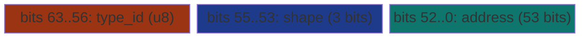
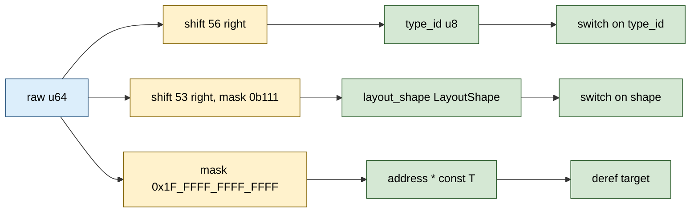

# SelfDescPointer&lt;T&gt;


A pointer that carries its own `(type_id, layout_shape)` description
in the stolen high bits of an 8-byte slot. Heterogeneous containers
dispatch on type without a vtable indirection: the type ID is the
high byte, and the compiler can lower the switch on it to a jump
table at the call site. The pointer steals 8 bits of type plus 3
bits of layout shape, leaving 53 bits for the virtual address.

> **The "type tag in the pointer" primitive.** Rust's idiomatic
> options for heterogeneous containers are `Box<dyn Trait>`
> (unbounded type universe, vtable cost), `enum` (closed but pays
> discriminant + payload overhead), and inline tagging. With a
> type universe bounded at 256, the byte switch on the pointer's
> high bits measured 3.0-3.4x faster than vtable dispatch and 1.4x
> faster than enum dispatch (see the [benchmark](#benchmark-results)).

**Constraints (read first):**

- **53-bit address envelope.** The low 53 bits of the u64 carry the
  address, 8 PiB of virtual space. User-space addresses on current
  x86_64 and AArch64 fit: Linux hands out addresses wider than 47
  bits (x86_64 5-level paging) or 48 bits (AArch64 52-bit VA) only
  to a process that asks for them with an mmap hint.
- **`from_raw` is `unsafe`.** The caller asserts the address fits
  in 53 bits and the target stays valid for the pointer's
  lifetime.
- **The address check is `debug_assert!`, not `assert!`.**
  `from_raw` debug-asserts `addr & !ADDR_MASK == 0` and then masks
  the address, so a release build drops an address's bits above
  53 and `as_raw()` returns a different address than the one
  passed in. The type ID and shape are unaffected. Validate at the
  trust boundary if your allocator can return pointers above
  8 PiB.
- **256-type ceiling.** `type_id: u8` covers 256 distinct types.
  Wider universes need `Box<dyn Trait>`, an enum, or a more
  elaborate encoding (sharded by layout shape, hierarchical IDs).
- **8 shape values exhausted.** `LayoutShape` is 3 bits encoding
  8 shapes: Scalar, FixedArray, RaggedArray, Tree, Graph,
  HashBucket, Sparse, UserDefined. `UserDefined` is the escape
  hatch for caller-specific extensions but only one value.
- **No drop semantics.** `SelfDescPointer<T>` is `Copy`; it does
  not own the target.
- **In-process only.** The address is a real virtual address.
  Cross-process sharing needs composition with a region-table
  primitive (e.g. `KTower2`) or address relocation.
- **`set_type_id` and `set_layout_shape` are safe.** Each takes
  `&mut self` and rewrites one field, leaving the other field and
  the address as they were. There is no method to update the
  address; that takes a new `from_raw`.
- **Layout dispatch is the caller's job.** The pointer carries the
  `LayoutShape` byte but does not change how the target is laid
  out. The caller's dispatch table (one per shape) is what makes
  the shape useful.

---

## Table of contents

- [What it is](#what-it-is)
- [Why a tag in the pointer](#why-a-tag-in-the-pointer)
- [Layout](#layout)
- [LayoutShape values](#layoutshape-values)
- [API at a glance](#api-at-a-glance)
- [Worked example](#worked-example)
- [Benchmark results](#benchmark-results)
- [Use case patterns](#use-case-patterns)
- [Known limitations (verified)](#known-limitations-verified)
- [Common pitfalls](#common-pitfalls)

---

## What it is

`SelfDescPointer<T>` is a single `u64` with three packed fields:

```rust
#[repr(transparent)]
pub struct SelfDescPointer<T> {
    raw: u64,
    _phantom: PhantomData<*const T>,
}
```

The high byte holds the type ID, the next 3 bits hold the layout
shape, and the low 53 bits hold the virtual address:


```mermaid
block-beta
  columns 3
  t["bits 63..56: type_id (u8)"] s["bits 55..53: shape (3 bits)"] a["bits 52..0: address (53 bits)"]
  classDef tagC fill:#9a3412,color:#ffffff
  classDef shapeC fill:#1e3a8a,color:#ffffff
  classDef addrC fill:#0f766e,color:#ffffff
  class t tagC
  class s shapeC
  class a addrC
```

Construction packs the fields with shifts and ORs. Access reads
the field via shift + mask. There is no allocation; the entire
type descriptor lives in the pointer slot.

---

## Why a tag in the pointer

Heterogeneous containers in Rust face three established options:

| Mechanism | Per-call cost | Type universe | Notes |
|---|---|---|---|
| `Arc<dyn Trait>` | indirect call via vtable | unbounded | Shared ownership; atomics only on clone and drop. |
| `Box<dyn Trait>` | indirect call via vtable | unbounded | Single-owner; no atomic overhead. |
| `enum` | tag-load + match | closed | Idiomatic; pays discriminant + payload cost per slot. |
| `SelfDescPointer<T>` | one u64 load + shift + match | <= 256 | Closed universe + zero indirection. |

The `dyn Trait` path goes through a vtable: the compiler cannot
inline the called method because the function pointer is loaded
from the vtable at runtime. The `enum` path sizes every slot for
the largest variant, so a vec of mixed small and large variants
pays the large variant's size per slot.

`SelfDescPointer` keeps the type universe closed (every
participating type has an agreed ID) but takes the byte-switch
path: the compiler sees a
`match p.type_id() { 1 => ..., 2 => ..., 3 => ... }` on the high
byte of the u64, which it can lower to a jump table. No indirect
call, no oversized payload, no per-element memory allocation
beyond the 8-byte slot.

---

## Layout


```mermaid
flowchart LR
    A[raw u64] --> B[shift 56 right]
    A --> C[shift 53 right, mask 0b111]
    A --> D[mask 0x1F_FFFF_FFFF_FFFF]
    B --> E[type_id u8]
    C --> F[layout_shape LayoutShape]
    D --> G[address * const T]
    E --> H[switch on type_id]
    F --> I[switch on shape]
    G --> J[deref target]
    classDef pack fill:#dceefb,stroke:#1f4e79,color:#000
    classDef extract fill:#fff2cc,stroke:#7f6000,color:#000
    classDef use fill:#d5e8d4,stroke:#2d5d2d,color:#000
    class A pack
    class B,C,D extract
    class E,F,G,H,I,J use
```

`#[repr(transparent)] u64`: `Vec<SelfDescPointer<T>>` has the same
layout as `Vec<u64>`. Eight pointers per cache line. The type
byte is at the most-significant byte position so the compiler can
emit a single `mov` + `shr 56` to extract it; or, on x86_64, a
single byte-read from the high byte of the slot.

---

## LayoutShape values

| Variant | u8 | Meaning |
|---|---|---|
| `Scalar` | 0 | Single scalar value (e.g. `u64`, `f64`). |
| `FixedArray` | 1 | Fixed-size array, length implicit in type ID. |
| `RaggedArray` | 2 | Variable-length array (`Vec`-like). |
| `Tree` | 3 | Recursive tree node. |
| `Graph` | 4 | Graph node (may carry cycles). |
| `HashBucket` | 5 | Hash table bucket (chain or open). |
| `Sparse` | 6 | Sparse / nullable slot (may be absent). |
| `UserDefined` | 7 | Caller-defined extension. |

Three bits, exactly 8 values, no expansion path without breaking
the encoding. The `UserDefined` variant is the escape hatch but
collapses the entire user-extension universe to one shape value.

---

## API at a glance

```rust
// Construction (unsafe: caller asserts target validity)
let p: SelfDescPointer<u64> = unsafe {
    SelfDescPointer::from_raw(target_ptr, type_id, LayoutShape::Scalar)
};

// Accessors
let t = p.type_id();          // u8
let s = p.layout_shape();     // LayoutShape
let r = p.raw();              // u64 (whole packed slot)
let target: *const u64 = p.as_raw();  // the address, type and shape bits masked off

// Field updates (mutating)
let mut p = p;
p.set_type_id(99);
p.set_layout_shape(LayoutShape::Graph);
```

The `Hash` and `PartialEq` impls compare and hash the raw u64,
so two `SelfDescPointer`s are equal exactly when their type ID,
shape, and address all match. This makes them suitable as
hash-map keys.

---

## Worked example

A heterogeneous container of mixed handle types dispatched without
a vtable:

```rust
use subetha_pointers::self_desc_pointer::{LayoutShape, SelfDescPointer};

const TYPE_USER: u8 = 1;
const TYPE_DOC: u8 = 2;
const TYPE_TAG: u8 = 3;

struct User { id: u64 }
struct Doc { words: Vec<String> }

let users = vec![User { id: 1 }, User { id: 2 }];
let docs = vec![Doc { words: vec!["hello".into()] }];

// One container of type-erased pointers, each carrying its type.
let mut handles: Vec<SelfDescPointer<u8>> = Vec::new();
for user in &users {
    let target = (user as *const User).cast::<u8>();
    handles.push(unsafe { SelfDescPointer::from_raw(target, TYPE_USER, LayoutShape::Scalar) });
}
for doc in &docs {
    let target = (doc as *const Doc).cast::<u8>();
    handles.push(unsafe { SelfDescPointer::from_raw(target, TYPE_DOC, LayoutShape::RaggedArray) });
}

// Dispatch loop: a switch on the high byte, no vtable.
let mut counts = [0u32; 256];
for h in &handles {
    counts[h.type_id() as usize] += 1;
}
assert_eq!(counts[TYPE_USER as usize], 2);
assert_eq!(counts[TYPE_DOC as usize], 1);
assert_eq!(counts[TYPE_TAG as usize], 0);

// Dereferencing goes back through the type the ID names.
for h in &handles {
    match h.type_id() {
        TYPE_USER => {
            let user = unsafe { &*h.as_raw().cast::<User>() };
            assert!(user.id >= 1);
        }
        TYPE_DOC => {
            let doc = unsafe { &*h.as_raw().cast::<Doc>() };
            assert_eq!(doc.words.len(), 1);
        }
        _ => unreachable!(),
    }
}
```

Each iteration is one u64 load + one shift + one indexed
increment. No allocation, no vtable indirection, no atomic op.

---

## Benchmark results

Bench: `crates/subetha-pointers/benches/bitsteal_pointers.rs`,
function `dispatch_via_vtable_vs_byte`. Four contenders dispatching
the same 3-type universe across 1 024 elements.

Measured on Windows 11 / Zen+ R7 2700, criterion at
`--measurement-time 2 --warm-up-time 1 --sample-size 30` (middle
estimate of each [low, mid, high] triple).

| Contender | Time | vs floor | Per-element |
|---|---|---|---|
| `bitsteal.self_desc/arc_dyn_vtable` (`Vec<Arc<dyn Handle>>`) | **2.45 us** | 3.00x | 2.39 ns |
| `bitsteal.self_desc/box_dyn_vtable` (`Vec<Box<dyn Handle>>`) | **2.77 us** | 3.39x | 2.70 ns |
| `bitsteal.self_desc/enum_tag_match` (`Vec<EnumHandle>`) | **1.16 us** | 1.42x | 1.13 ns |
| `bitsteal.self_desc/byte_switch_no_vtable` (`Vec<SelfDescPointer<u64>>`) | **817 ns** | 1.00x (floor) | 0.80 ns |

Every contender runs the same loop: dispatch on each element's kind
and bump one of three counters.

- **Arc and Box land in the same band.** The loop calls only
  `kind()` through the vtable and never clones or drops the smart
  pointer, so no refcount is touched. `Box<dyn>` measured slightly
  slower than `Arc<dyn>` here (2.77 us against 2.45 us); the
  difference between them is layout and noise, not refcounting.
- **dyn -> enum: 2.1-2.4x (2.45-2.77 us -> 1.16 us).** Removing the
  vtable indirect call is the big win. The enum carries the
  discriminant inline; the compiler emits a tag-load + jump.
- **Enum -> SelfDescPointer: 1.42x (1.16 us -> 817 ns).**
  The enum slot is sized to the largest variant (a `Vec` or boxed
  payload, ~24-32 bytes per slot); `SelfDescPointer` is exactly
  8 bytes per slot, so more elements fit per cache line.

**Per-element cost** of the byte switch is 0.80 ns: one load, one
shift and a branch to one of three counters held in registers.

**When the byte switch is the right choice:**

- Heterogeneous containers with closed type universe.
- Hot dispatch sites where the type fan-out is small (the bench
  measured three types).
- Cache-bound workloads where 8-byte slot size matters.
- Containers that act as a type-tag dictionary (lookup, then
  re-tag in place via `set_type_id`).

**When dyn Trait is the right choice:**

- Unbounded type universe (plugins, user-extensible types).
- Heap-allocated objects with shared ownership (Arc).
- Dispatch sites that are cold and not in a hot loop.

**When enum is the right choice:**

- Closed type universe with variant-specific payloads (the enum
  is the value, not a pointer to it).
- Read-once values (no need for type-tag updates).

---

## Use case patterns

| Pattern | Use `SelfDescPointer` for | Why |
|---|---|---|
| **Heterogeneous slot table** | Mix of small types in one container, dispatch on type | The byte switch measured 3.0-3.4x faster than vtable dispatch. |
| **Polymorphic AST / IR node** | Each node carries its (kind, shape) inline | Visitor pattern dispatches without a vtable; saves a load per visit. |
| **Tagged union with 256 types** | When `enum` is too restrictive but `Box<dyn>` is too slow | Closed universe + zero indirection. |
| **JIT compiler value tags** | Values carry their representation tag (int, float, ptr, bool) | The idea behind LuaJIT's NaN-tagging, with the tag in a pointer's high bits instead of a NaN's payload. |
| **Garbage collector roots** | Each root carries (collector tier, layout) inline | GC walks the slot table; tier dispatch is one byte switch. |

---

## Known limitations (verified)

These have all been confirmed by reading the source or running
the bench:

- **53-bit address envelope is `debug_assert!`, not runtime check.**
  `from_raw`'s `debug_assert!(addr & !ADDR_MASK == 0)` is compiled
  out in release without `debug-assertions = true`, and the address
  is then masked, so a pointer with bits above 53 set comes back
  from `as_raw()` as a different address. Validate at the trust
  boundary.
- **256-type ceiling.** `type_id` is a `u8` (high 8 bits, shift 56).
  Sufficient for most heterogeneous containers but not arbitrary
  plugin systems.
- **3-bit shape field is exhausted.** The `LayoutShape` enum has
  exactly 8 variants (Scalar..UserDefined). No path to a 9th shape
  without breaking the encoding.
- **No mutable address update.** Source has `set_type_id` and
  `set_layout_shape` but no `set_address`. Updating the address
  requires constructing a new `SelfDescPointer`.
- **`LayoutShape` is informational only.** The pointer stores the
  shape byte but does not change how the target is laid out. The
  caller's dispatch table is what makes the shape useful.
- **`PartialEq` and `Hash` use the whole u64.** Two pointers with
  the same address but different type_id or shape are not equal.
  This is the desired behavior for type-tag-aware dictionaries but
  may surprise callers expecting address-based equality.

---

## Common pitfalls

- **Don't pass an address with high bits set.** The 53-bit
  envelope is enforced only by `debug_assert!`. Mask or validate
  at the trust boundary if your allocator may return pointers
  with bits 53-63 set.
- **Don't assume `as_raw()` gives a `*const T` that is safe to
  deref blindly.** It's the recovered 53-bit address; if the
  original target has been freed, dereferencing it is undefined
  behavior. The use pattern is "dispatch-then-deref", not
  "deref-then-dispatch".
- **Don't reuse type IDs across modules without coordination.**
  The byte switch fans out on type_id; if two modules pick the
  same ID for different types, the dispatch will conflate them.
  Reserve type ID ranges per module at the architecture level.
- **Don't use `SelfDescPointer` for unbounded type universes.**
  Once your type count exceeds 256 you have to either fall back
  to dyn Trait or shard by layout shape (using shape to extend
  the type universe to 256 * 8 = 2048). The shard-by-shape path
  is doable but requires caller discipline.
- **Don't expect cross-process portability.** The address is a
  real machine pointer. For cross-process sharing compose with
  a region-table primitive.
- **Don't confuse `SelfDescPointer<T>` with `*const T`.** Same
  size but the encoded form is not a machine address, and
  dereferencing `p.raw() as *const T` is undefined behavior. Use
  `p.as_raw()`, which masks the high bits.

---
