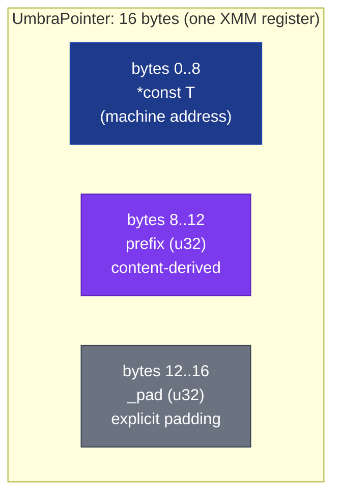
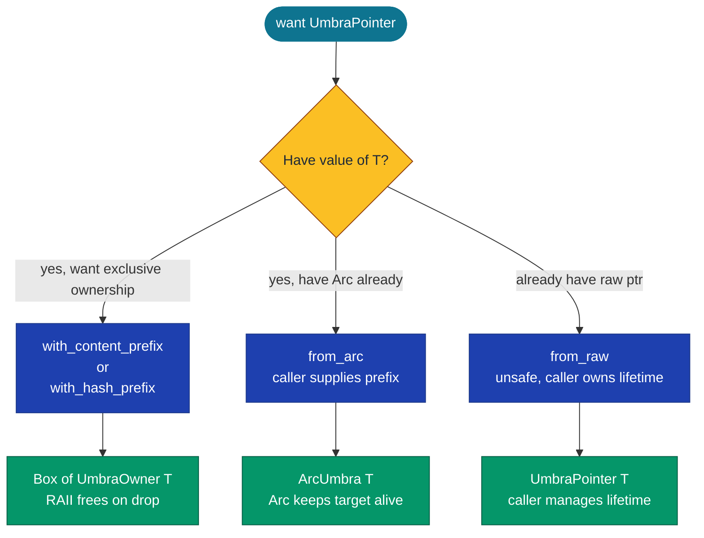
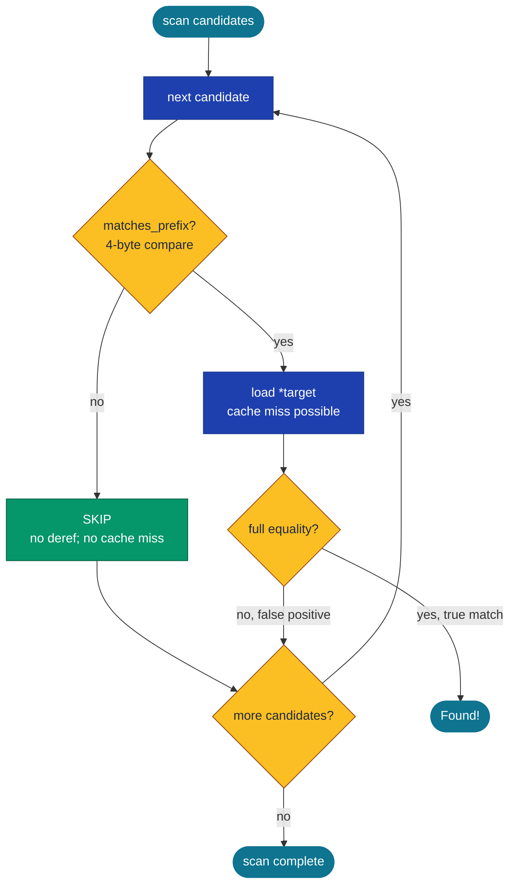

# UmbraPointer&lt;T&gt;, UmbraOwner&lt;T&gt;, ArcUmbra&lt;T&gt;


-success)


A generic content-prefixed pointer that fits in one XMM register
(16 bytes: 8-byte pointer + 4-byte content prefix + 4-byte
padding). Equality and lookup operations check the 4-byte prefix
in-register **before** touching the pointed-to allocation. For
workloads where most candidates miss (HashMap bucket walks, dedup
scans, RDF subject lookups, scattered large-payload accesses),
the prefix shortcircuits the deref and eliminates the cache miss
on the target.

> **The generic version of the Umbra-strings prefix trick.** The
> Umbra paper (Neumann + Freitag, CIDR 2020) introduced 16-byte
> string pointers that pack a 4-byte content prefix alongside the
> pointer to enable in-register equality fast-rejection. This
> primitive is the same idea, parameterised over any `T` instead
> of just `&str`; it works for any heap-allocated payload. The
> MMF-resident sibling for cross-process use is
> [`SharedUmbraPointer`](../../subetha-cxc/specialized/shared-umbra-pointer/).

**Constraints (read first):**

- **In-process only.** `target: *const T` is a raw machine
  address; the pointer is not portable across processes. For
  cross-process Umbra-style pointers, see
  [`SharedUmbraPointer`](../../subetha-cxc/specialized/shared-umbra-pointer/).
- **`T: Sized`.** The struct stores a thin pointer (`*const T`,
  exactly 8 bytes). Unsized targets (`[u8]`, `str`, `dyn Trait`)
  require wrapping in a sized container (`Box<[u8]>`,
  `Arc<str>`, etc.) at the application layer first.
- **`UmbraPointer::from_raw` is `unsafe`.** Caller is responsible
  for keeping the target alive AND for choosing a prefix that is
  a deterministic function of the content; arbitrary prefixes
  make `prefix_eq` semantically meaningless. The safe entry
  points are `with_content_prefix` (returns
  `Box<UmbraOwner<T>>`), `with_hash_prefix` (same), and
  `from_arc` (returns `ArcUmbra<T>`).
- **`with_content_prefix` reads `T`'s first 4 bytes in native
  byte order.** On a little-endian host the prefix is the
  low-address 4 bytes; on big-endian it is the high-address 4
  bytes. The same `T` value produces different prefixes on hosts
  of opposite endianness. Persistence and cross-host workflows
  must use `with_hash_prefix` or `from_raw` with an explicit
  deterministic hash.
- **`with_hash_prefix` uses `std::collections::hash_map::DefaultHasher`,
  truncated to the low 32 bits.** `DefaultHasher` may be
  randomized per process in some Rust versions. Two processes
  hashing the same content may compute different prefixes; this
  is NOT a content-addressing-stable hash.
- **Prefix is 4 bytes (32 bits).** Birthday-bound collision
  probability is ~50% at ~65 K distinct prefixes. Treat
  prefix-equality as a candidate-filter, not a definitive
  content-match.
- **`UmbraOwner<T>` is returned wrapped in a `Box`.** Both
  `with_content_prefix` and `with_hash_prefix` return
  `Box<UmbraOwner<T>>`, not a raw `UmbraOwner<T>`. The Box is the
  RAII handle; dropping it runs `UmbraOwner::drop`, which
  reclaims the heap allocation via `Box::from_raw`.

---

## Table of contents

- [What they are](#what-they-are)
- [When to reach for it](#when-to-reach-for-it)
- [Memory layout](#memory-layout)
- [Three construction modes](#three-construction-modes)
- [The skip-on-mismatch protocol](#the-skip-on-mismatch-protocol)
- [API at a glance](#api-at-a-glance)
- [Worked example](#worked-example)
- [Benchmark results](#benchmark-results)
- [Where Umbra wins, where it loses](#where-umbra-wins-where-it-loses)
- [Use case patterns](#use-case-patterns)
- [Known limitations (verified)](#known-limitations-verified)
- [Common pitfalls](#common-pitfalls)

---

## What they are

`UmbraPointer<T>` is the raw 16-byte slot:

```rust
#[repr(C, align(16))]
pub struct UmbraPointer<T> {
    target: *const T,      // offset 0..8  (8 bytes)
    prefix: u32,           // offset 8..12 (4 bytes)
    _pad: u32,             // offset 12..16 (explicit padding to 16)
    _phantom: PhantomData<T>,
}
```

The pointer is laid out so the target occupies bytes 0..8 (the
natural pointer-alignment slot) and the prefix occupies bytes
8..12 with explicit `_pad` filling the 16-byte slot. SIMD scans
over an array of `UmbraPointer<T>` see consistent prefix-byte
positions at offset 8 in every slot, enabling a packed-quadword
gather on the prefix half-register.

`UmbraOwner<T>` is the RAII wrapper for the Box-heap path: it
owns the pointed-to allocation, with `Drop` that reclaims it via
`Box::from_raw`:

```rust
pub struct UmbraOwner<T> {
    ptr: UmbraPointer<T>,
}
```

`ArcUmbra<T>` is the RAII wrapper for the Arc-sharing path: the
`Arc<T>` keeps the target alive; `ArcUmbra::Clone` bumps the
Arc's reference count:

```rust
pub struct ArcUmbra<T> {
    ptr: UmbraPointer<T>,
    _arc: Arc<T>,
}
```

The three types compose: `UmbraPointer<T>` is the bare 16-byte
fact, `UmbraOwner<T>` and `ArcUmbra<T>` are the two safe entry
points for constructing one with a managed target lifetime.

## When to reach for it

Reach for `UmbraPointer<T>` (via `UmbraOwner` or `ArcUmbra`) when:

- The workload does **scans over collections of pointers** looking
  for a match; most candidates miss; the candidate test is cheap
  but the deref of `T` is expensive.
- Deref-and-compare on `T` would touch a **separate cache line**
  per pointer (large payloads, scattered allocations, no
  prefetch). The 16-byte slot keeps the prefix scan dense; only
  the rare prefix-hit pays the cache-miss cost.
- The data structure is a **HashMap bucket chain**, a **dedup
  set**, or an **RDF/triple-store subject index** where the
  expected miss rate is high (most lookups walk past most
  candidates).
- You need a **deterministic content-derived prefix** for fast
  rejection and you control the hash function. `with_hash_prefix`
  is convenient but not cross-host stable; for persistence,
  construct via `from_raw` with an explicit hash.

Reach for something else when:

- The payload is small (a few bytes). The deref is free; the
  prefix scan is overhead. See the cache_pressure bench loss
  (0.69x) below for the quantified case.
- The workload accesses elements **sequentially with high hit
  rate** (e.g. `Vec<T>` iteration where every element is
  processed). The shortcircuit never fires; the prefix becomes
  dead weight.
- You need cross-process visibility. Use an MMF-backed primitive
  instead.
- You need cryptographically-stable content-addressing.
  `DefaultHasher` is not cryptographic; supply your own via
  `from_raw`.

## Memory layout



The explicit `_pad: u32` field is what gives `UmbraPointer<T>`
its 16-byte size regardless of `T`. Without it, Rust would size
the struct to `sizeof(ptr) + sizeof(u32) = 12` bytes (with
4-byte trailing alignment to the next u32 boundary), which would
make every slot 12 bytes - awkward for SIMD scans because slots
would not be 16-aligned in an array.

The pointer occupies bytes 0..8 (its natural 8-byte alignment
slot); the prefix sits at bytes 8..12. A SIMD scan that loads
one slot per XMM register sees the prefix in the high half of
the register, in a position consistent across all slots in the
array.

## Three construction modes



| Construction | Prefix derivation | Lifetime owner | When to use |
|---|---|---|---|
| `with_content_prefix(T)` | First 4 bytes of `T`'s representation, in native byte order | `Box<UmbraOwner<T>>` | T's first 4 bytes are a meaningful key (row ID, packet header, etc.) AND you do not need cross-host portability |
| `with_hash_prefix(T)` | `DefaultHasher::finish() as u32` (low 32 bits of u64 output) | `Box<UmbraOwner<T>>` | Near-uniform random prefix for HashMap-style rejection; T is unique enough that collision is rare |
| `from_arc(Arc<T>, prefix: u32)` | Caller-supplied | `ArcUmbra<T>` (Arc keeps target alive) | You already have an Arc; you want shared ownership; you supply the prefix from your own hash function |
| `from_raw(prefix, *const T)` | Caller-supplied | None (caller manages) | Hot-path construction over an existing pointer; unsafe |

## The skip-on-mismatch protocol



The architectural win is **eliminating dereferences whose target
is on a cold cache line**. The 16-byte slot ensures the scan
itself stays dense (one cache line covers 4 slots); only the
prefix-hit path pays the cost of loading the target's bytes.

When the prefix is content-derived AND the target is
unpredictable (scattered heap allocations, no prefetch), this
turns into a multi-x speedup. When the target is small or always
in cache, the shortcircuit adds overhead without saving anything.

## API at a glance

<details open>
<summary><b>UmbraPointer&lt;T&gt;</b></summary>

| Method | Signature | Notes |
|---|---|---|
| `from_raw` (unsafe) | `const unsafe fn(prefix: u32, target: *const T) -> Self` | Caller responsible for target lifetime AND prefix derivation |
| `with_content_prefix` | `fn(value: T) -> Box<UmbraOwner<T>>` | Heap-allocates value via Box; prefix is first 4 bytes |
| `with_hash_prefix` | `fn(value: T) -> Box<UmbraOwner<T>> where T: Hash` | Heap-allocates value via Box; prefix is DefaultHasher u32 |
| `from_arc` | `fn(value: Arc<T>, prefix: u32) -> ArcUmbra<T>` | Caller supplies the prefix; Arc keeps target alive |
| `prefix` | `const fn(&self) -> u32` | Returns the 4-byte content prefix |
| `as_raw` | `const fn(&self) -> *const T` | Returns the raw target pointer |
| `prefix_eq` | `const fn(&self, &Self) -> bool` | 4-byte equality, no deref |
| `matches_prefix` | `const fn(&self, query: u32) -> bool` | 4-byte equality against a literal query |
| `deref_unchecked` (unsafe) | `unsafe fn(&self) -> &T` | Raw deref; caller must know target is live |

`UmbraPointer<T>` is `Send` when `T: Send` and `Sync` when
`T: Sync`. The raw pointer is treated as an integer for these
auto-trait impls.

</details>

<details open>
<summary><b>UmbraOwner&lt;T&gt;</b></summary>

| Method | Signature | Notes |
|---|---|---|
| `ptr` | `fn(&self) -> &UmbraPointer<T>` | Borrow the contained 16-byte pointer |
| `prefix` | `fn(&self) -> u32` | Borrow the prefix directly |
| `value` | `fn(&self) -> &T` | Safe deref through the owned Box |
| `Drop` | impl | Reclaims the target via `Box::from_raw` |

`UmbraOwner` does NOT implement `Clone`. To copy ownership of
the target, build a second `UmbraOwner` from a fresh allocation
OR use the `ArcUmbra` shared-ownership variant.

</details>

<details open>
<summary><b>ArcUmbra&lt;T&gt;</b></summary>

| Method | Signature | Notes |
|---|---|---|
| `ptr` | `fn(&self) -> &UmbraPointer<T>` | Borrow the contained 16-byte pointer |
| `prefix` | `fn(&self) -> u32` | Borrow the prefix directly |
| `value` | `fn(&self) -> &T` | Safe deref through the Arc |
| `into_arc` | `fn(self) -> Arc<T>` | Consume the wrapper; return the underlying Arc (clones it; the wrapper is also dropped) |
| `Clone` | impl | Bumps the Arc refcount and copies the 16-byte UmbraPointer |

</details>

## Worked example

```rust
use std::sync::Arc;
use subetha_pointers::umbra_pointer::{ArcUmbra, UmbraPointer};

// 1024 records, each with a 4-byte hash prefix and 8-byte payload.
// Build them as ArcUmbras so they can be cloned cheaply.
let records: Vec<ArcUmbra<u64>> = (0..1024u64)
    .map(|i| {
        let arc = Arc::new(i * 1000);
        let prefix = (i ^ 0xDEAD_BEEF) as u32;  // content-derived hash
        UmbraPointer::from_arc(arc, prefix)
    })
    .collect();

// Lookup a record by prefix. The 4-byte compare runs against all
// 1024 candidates in O(N); most miss without dereferencing.
let query_prefix = (777u64 ^ 0xDEAD_BEEF) as u32;
let mut hits = 0;
for r in records.iter() {
    if r.ptr().matches_prefix(query_prefix) {
        // Only deref when prefix matches. For a 32-bit prefix
        // over 1024 entries, false-positive probability is
        // ~1024 / 2^32 = negligible.
        if *r.value() == 777_000 {
            hits += 1;
        }
    }
}
assert_eq!(hits, 1);

// Box-owned variant. The Box<UmbraOwner<T>> manages the target
// lifetime; drop the Box, the inner Box is freed.
let owner = UmbraPointer::with_content_prefix(0xCAFE_BABE_DEAD_BEEF_u64);
// On little-endian: first 4 bytes of u64 are 0xEF 0xBE 0xAD 0xDE
// -> u32 = 0xDEAD_BEEF.
assert_eq!(owner.prefix(), 0xDEAD_BEEF);
assert_eq!(*owner.value(), 0xCAFE_BABE_DEAD_BEEF_u64);
```

## Benchmark results

Baseline: a `Vec<Arc<T>>` of 1024 entries, scanned in a loop with
`**arc == query` per candidate. The Umbra path uses
`Vec<ArcUmbra<T>>` and `matches_prefix(query_prefix)` before any
deref.

Bench: `crates/subetha-pointers/benches/umbra_pointer.rs`. Measured
on Windows 11 / Zen+ R7 2700, criterion at `--measurement-time 2
--warm-up-time 1 --sample-size 30` (middle estimate of each
[low, mid, high] triple).

| Workload | native_arc | umbra_prefix | Ratio |
|---|---:|---:|---:|
| `scan_late_match` (match at last index, 1024 entries) | 771 ns | **736 ns** | **1.05x umbra wins** |
| `scan_full_miss` (no match, full scan) | **667 ns** | 686 ns | 0.97x (parity; native marginally ahead) |
| `scan_cache_pressure` (forced sum reduction over all 1024) | **496 ns** | 717 ns | 0.69x (baseline wins; honest loss) |
| `scattered_miss` (64-byte payloads, scattered heap, shuffled access) | 1.50 us | **1.24 us** | **1.21x umbra wins** |

### Why each result lands where it does

<details>
<summary><b>scan_late_match: umbra wins 1.05x</b></summary>

The match is at index N-1 (last entry). Both paths scan all 1024
candidates.

The native path dereferences every Arc to read its u64 payload
and compare. The Arcs were allocated sequentially so the heap
allocator likely interleaved them on adjacent cache lines, but
each deref still touches a separate Arc-allocation address.

The umbra path checks `matches_prefix` (one register compare)
before any deref. 1023 of the 1024 candidates fail the prefix
check and skip; only the last one dereferences. That deref hits
the same Arc allocation the native path would have hit, but it
happens once instead of 1024 times.

The 1.05x ratio reflects the savings: 1023 saved derefs at a
fraction of a nanosecond each, largely offset by the umbra's
slightly larger per-candidate fixed cost (16-byte slot load +
prefix-bit extract).

</details>

<details>
<summary><b>scan_full_miss: parity (native marginally ahead, 0.97x)</b></summary>

No candidate matches; both paths scan all 1024.

The native path dereferences every Arc. The umbra path checks
every prefix; none match, so it skips every deref.

In principle the umbra path should save more here than in
`scan_late_match` (zero derefs vs one), but in the shipped bench the two
paths land within measurement noise of each other and the native
path is marginally faster (667 ns vs 686 ns). The compiler
auto-vectorizes the native u64 compare in a tight loop, and the
small `u64` payload sits in the same cache line as the Arc header
on warm caches, so there is no cold-deref to skip. For `u64`
payloads in warm caches the prefix layer does not pay back; its
value appears only when the deref is genuinely expensive (see
`scattered_miss`).

</details>

<details>
<summary><b>scan_cache_pressure: native wins (umbra 0.69x, the honest loss)</b></summary>

This workload forces a sum reduction over all 1024 payloads.
Every entry IS consumed - there is no miss to skip.

The native path sums `**arc` for every entry. With sequential
heap layout and warm caches, this is a fast tight loop.

The umbra path checks `matches_prefix` for every entry against
a guaranteed-miss prefix, counting matches. The compare-and-
branch loop does N work and produces a constant result (0
matches).

But the prefix scan does 16-byte-stride reads while the native
deref does 8-byte-stride reads over a flatter Vec<Arc<u64>>.
The native loop's smaller working set fits better in L1 and
auto-vectorizes more cleanly.

**The architectural lesson:** Umbra's shortcircuit is a
miss-rate-amortizer. If your workload never misses (full
consumption), the prefix layer is overhead that does not pay
back. Use a plain `Vec<T>` or `Vec<Arc<T>>` for full-consumption
scans; reach for `UmbraPointer` only when most candidates can
be rejected.

</details>

<details>
<summary><b>scattered_miss: umbra wins 1.21x (the design-point regime)</b></summary>

64-byte `CacheLineBlob` payloads. Heap allocations are
interleaved with 4 KB scratch boxes to force scatter so
consecutive Arcs land on separate cache lines. Access order is
shuffled (bit-reversed indices) so the hardware prefetcher
cannot predict the next address.

Native: 1.50 us. The deref for each entry touches a cold cache
line; even though only `marker` (the first u64) is read, the
cache miss still costs a stall per access, partially overlapped
by out-of-order execution.

Umbra: 1.24 us. The prefix scan loads 16-byte slots from a
contiguous Vec<ArcUmbra>, which IS prefetcher-friendly because
the Vec itself is sequential. Misses on the prefix compare are
rare; derefs are zero (no prefix matches the query).

The 1.21x ratio is the largest umbra win of the four workloads
(this is the design point - expensive scattered derefs). It is
still bounded because the cache miss on the Arc target is
partially overlapped with the next prefix-load. The savings would
widen with:

- Larger payloads (1 KB+) so the cache miss on deref is more
  costly to amortize
- Higher hit rates on the prefix (so the prefix scan itself
  benefits from skipping more compare loop iterations)
- Older CPUs with weaker out-of-order execution

</details>

## Where Umbra wins, where it loses

Two-axis decision matrix:

| | Small payload (<32 B) | Large payload (>=64 B) |
|---|---|---|
| **High miss rate** (most candidates rejected) | Umbra is parity-to-marginal (0.97x-1.05x); for small in-cache `u64` the skipped deref barely pays for the prefix check | Umbra wins (1.21x in the shipped scattered bench; more with even larger payloads); the canonical design point |
| **Low miss rate** (most candidates accessed) | Native wins (0.69x is the loss case); the prefix is dead overhead | Native wins for sequential access; Umbra still helps for scattered access via cache-line-stride dense scan |

The "low miss rate, small payload" cell is the failure mode -
avoid `UmbraPointer` there. Everything else is a candidate.

## Use case patterns

<details>
<summary><b>Pattern 1: HashMap bucket chain with content keys</b></summary>

A custom open-addressing or chaining HashMap stores
`Vec<UmbraPointer<Entry>>` per bucket. Lookup walks the chain
checking `matches_prefix(hash(key) as u32)` before dereferencing
each Entry to do the full key comparison.

For typical hash distributions, the bucket chain has 1 to 4
entries, and the expected number of derefs per lookup drops
from "all entries in bucket" to "1 entry" (the actual key, when
it exists in the map). For dense maps with chain length over 4,
the per-entry savings compound.

</details>

<details>
<summary><b>Pattern 2: RDF subject-property-object dedup</b></summary>

Triple stores hash subjects, properties, and objects into
prefix-derived buckets. Dedup during ingest:

```rust
for triple in ingest_stream {
    let prefix = hash_subject(&triple.subject) as u32;
    if !subjects.iter().any(|s| s.matches_prefix(prefix)
                              && s.value() == &triple.subject) {
        // new subject; allocate via with_hash_prefix
        subjects.push(*UmbraPointer::with_hash_prefix(triple.subject.clone()));
    }
}
```

Most candidates miss; the prefix scan answers in 1 to 2 ns per
candidate without dereferencing the full subject byte string.

</details>

<details>
<summary><b>Pattern 3: content-addressed cache (CAS-style)</b></summary>

A blob cache stores `Vec<ArcUmbra<Vec<u8>>>` of cached blobs,
indexed by a deterministic content-hash prefix. Lookup:

1. Compute the 4-byte prefix from the query content.
2. Linear-scan `matches_prefix` over the cache.
3. On hit, dereference and compare full bytes (defensive against
   the 4-byte birthday-bound collision).

For caches small enough to scan linearly (~1000 entries), this
is faster than a HashMap because of cache-line-dense scanning;
for larger caches, layer with a coarser bucket index.

</details>

<details>
<summary><b>Pattern 4: scattered-payload graph traversal</b></summary>

A graph walker visits nodes by raw pointer. Each node is a
`Box<T>` with `T` ~64 bytes; consecutive visits hit cold cache
lines. Wrap each pointer in an `ArcUmbra<T>` with a node-id-
derived prefix; the walk first checks the prefix and only
dereferences nodes whose id matches the current frontier
predicate. Reduces the cold-cache-miss count in the worst case.

</details>

## Known limitations (verified)

1. **`UmbraPointer<T>` is in-process only.** The `target` field
   is a raw machine address. Cross-process storage requires
   layering this over MMF and using
   [`OffsetPtr`](../../subetha-cxc/pointers/offset-ptr/)
   for the cross-process leg.

2. **`from_raw` is `unsafe`.** No lifetime tracking; caller must
   guarantee the target outlives the pointer AND must supply a
   prefix derived deterministically from content.

3. **`T: Sized`.** Unsized targets do not fit the 8-byte thin-
   pointer slot. Wrap in `Box<[u8]>`, `Arc<str>`, or similar at
   the application layer.

4. **`with_content_prefix` byte order is native.**
   Little-endian and big-endian hosts produce different prefixes
   for the same `T`. Persistence and IPC must not rely on
   `with_content_prefix` for prefix stability.

5. **`with_hash_prefix` uses `DefaultHasher`.** Not
   cryptographically strong; not stable across Rust versions;
   may be randomized per process in some Rust versions. Use
   `from_raw` with an explicit hash for stable
   content-addressing.

6. **Prefix is 4 bytes (32 bits).** Birthday-bound collision at
   ~50% probability around ~65 K distinct prefixes; expected
   collisions for any pair of entries at ~1 in 4 billion. The
   prefix is a candidate-filter, not an equality test.

7. **`UmbraOwner<T>` does not implement `Clone`.** Owning the
   target by `Box` means there is no shared-ownership path;
   `ArcUmbra<T>` is the shared-ownership variant.

8. **`with_content_prefix` and `with_hash_prefix` always
   heap-allocate via `Box::new`.** There is no in-place
   variant. The Box is reclaimed when `UmbraOwner` drops.

9. **`PhantomData<T>` not `PhantomData<*const T>`.** This means
   `UmbraPointer<T>` is `Send` when `T: Send` and `Sync` when
   `T: Sync`, matching the auto-trait behavior for `Box<T>` /
   `Arc<T>`. Callers needing different variance must construct
   wrappers.

10. **No `Hash`, `PartialEq`, `Eq`, `PartialOrd`, `Ord` impls.**
    The crate explicitly chose not to derive these because the
    "correct" equality is application-dependent (prefix-only,
    prefix + deref, identity-only). Callers using
    `UmbraPointer` as a map key must implement these manually.

## Common pitfalls

<details>
<summary><b>Pitfall 1: assuming prefix equality implies content equality</b></summary>

```rust
// WRONG: 32-bit prefix collides at the birthday bound.
if a.ptr().prefix_eq(b.ptr()) {
    return true;  // BUG: false positives possible
}
```

A 4-byte prefix is a candidate filter. Confirm with a full
content compare on hit:

```rust
// CORRECT
if a.ptr().prefix_eq(b.ptr()) && a.value() == b.value() {
    return true;
}
```

</details>

<details>
<summary><b>Pitfall 2: <code>with_content_prefix</code> for cross-host data</b></summary>

The prefix is derived in native byte order. A little-endian host
writing `0xDEAD_BEEF_CAFE_BABE` as a u64 produces prefix
`0xCAFE_BABE` (low 4 bytes); a big-endian host produces
`0xDEAD_BEEF`. Persistence or IPC across host architectures will
mismatch.

Use `with_hash_prefix` (consistent within a single process run)
or, for full stability, `from_raw` with an explicit byte-order-
independent hash like Blake3 or FNV-1a.

</details>

<details>
<summary><b>Pitfall 3: relying on <code>DefaultHasher</code> stability</b></summary>

`std::collections::hash_map::DefaultHasher` is not guaranteed
stable across Rust standard library versions. Two Rust toolchain
versions may compute different prefixes for the same `T`.

For persistence-stable content addressing, supply your own hash
function and use `from_raw` or `from_arc` directly:

```rust
use blake3::Hasher;
fn stable_prefix<T: AsRef<[u8]>>(v: &T) -> u32 {
    let mut h = Hasher::new();
    h.update(v.as_ref());
    let d = h.finalize();
    u32::from_le_bytes(d.as_bytes()[..4].try_into().unwrap())
}
```

</details>

<details>
<summary><b>Pitfall 4: using <code>UmbraPointer</code> on warm-cache small-payload scans</b></summary>

If every entry in the scan is consumed (no early-out), the
prefix layer is pure overhead. The `scan_cache_pressure` bench
shows the 0.69x loss case (native wins ~1.45x).

Decision rule: only use `UmbraPointer` when the expected miss
rate is high (above 50%) AND the deref cost is non-trivial
(payload at least one cache line, or scattered heap allocation).
For full-consumption sequential scans of small payloads, use
`Vec<T>` directly.

</details>

<details>
<summary><b>Pitfall 5: forgetting that <code>with_*_prefix</code> returns <code>Box</code></b></summary>

```rust
// Pattern that LOOKS right but allocates ownership inside Box:
let owner = UmbraPointer::with_content_prefix(42u64);
// owner is Box<UmbraOwner<u64>>, not UmbraOwner<u64>.
// To dereference twice (once through Box, once through value):
let v: &u64 = owner.value();
```

The Box wrapping is an implementation choice; the API method
calls auto-deref through the Box so most call sites do not
notice. The lifetime is tied to the outer Box.

</details>

---

[back to subetha-pointers docs](../../)
