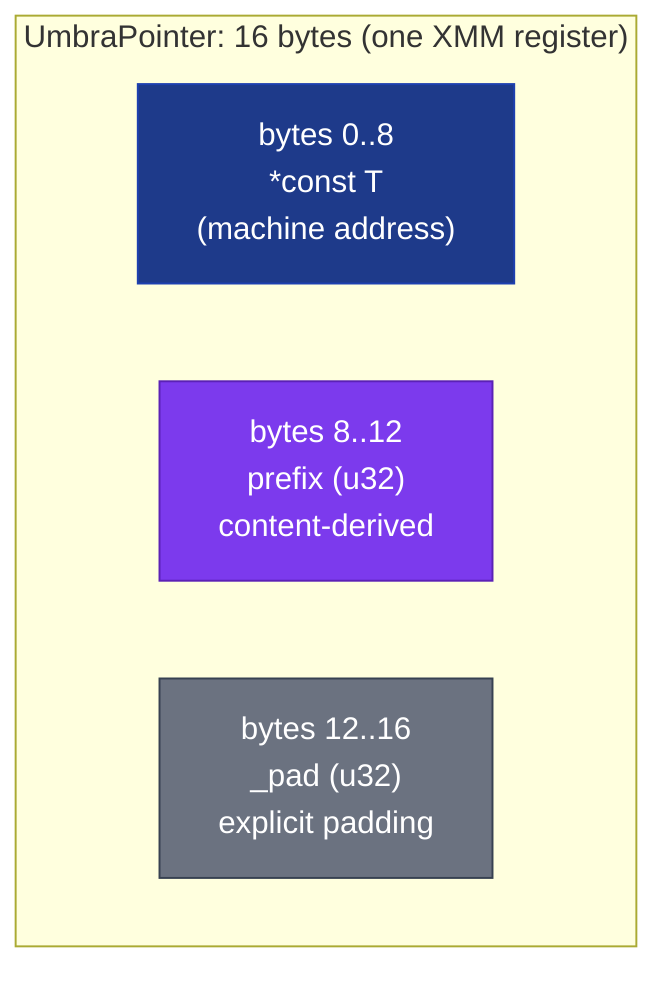
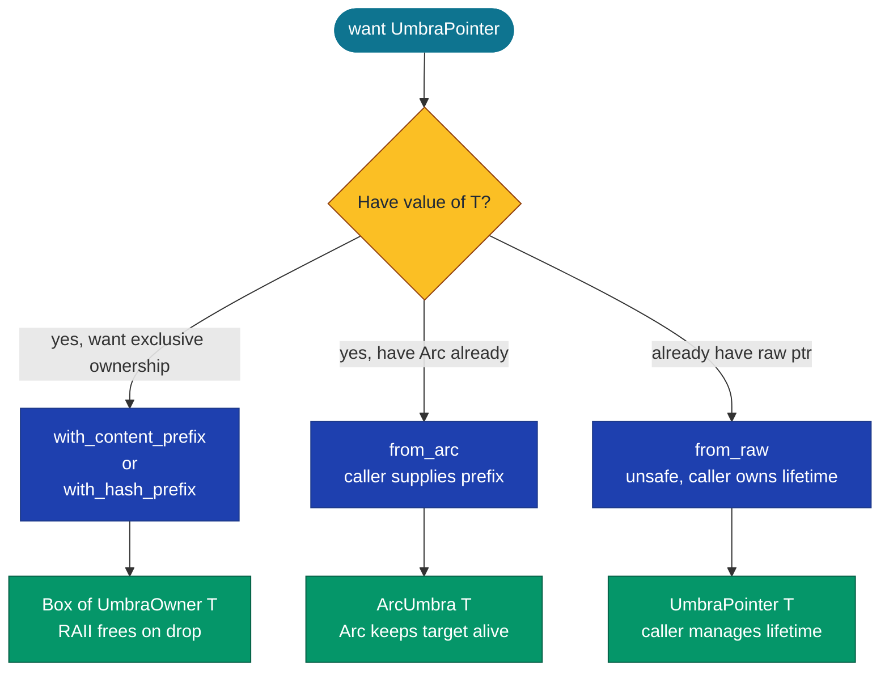
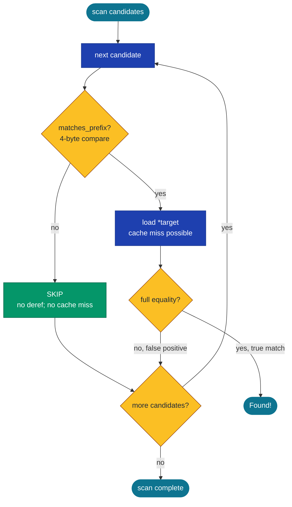

# UmbraPointer&lt;T&gt;, UmbraOwner&lt;T&gt;, ArcUmbra&lt;T&gt;


-success)


A generic content-prefixed pointer that fits in one XMM register
(16 bytes: 8-byte pointer + 4-byte content prefix + 4-byte
padding). Equality and lookup operations check the 4-byte prefix
in-register **before** touching the pointed-to allocation. For
workloads where most candidates miss (HashMap bucket walks, dedup
scans, RDF subject lookups, scattered large-payload accesses),
the prefix shortcircuits the deref and eliminates the cache miss
on the target.

> **The generic version of the Umbra-strings prefix trick.** The
> Umbra paper (Neumann + Freitag, CIDR 2020) introduced 16-byte
> string pointers that pack a 4-byte content prefix alongside the
> pointer to enable in-register equality fast-rejection. This
> primitive is the same idea, parameterized over any `T` instead
> of just `&str`; it works for any heap-allocated payload. The
> MMF-resident sibling for cross-process use is
> [`SharedUmbraPointer`](../../subetha-cxc/specialized/shared-umbra-pointer/).

**Constraints (read first):**

- **In-process only.** `target: *const T` is a raw machine
  address; the pointer is not portable across processes. For
  cross-process Umbra-style pointers, see
  [`SharedUmbraPointer`](../../subetha-cxc/specialized/shared-umbra-pointer/).
- **`T: Sized`.** The struct stores a thin pointer (`*const T`,
  exactly 8 bytes). Unsized targets (`[u8]`, `str`, `dyn Trait`)
  require wrapping in a sized container (`Box<[u8]>`,
  `Arc<str>`, etc.) at the application layer first.
- **`UmbraPointer::from_raw` is `unsafe`.** Caller is responsible
  for keeping the target alive and for choosing a prefix that is
  a deterministic function of the content; arbitrary prefixes
  make `prefix_eq` semantically meaningless. The safe entry
  points are `with_content_prefix` (returns
  `Box<UmbraOwner<T>>`), `with_hash_prefix` (same), and
  `from_arc` (returns `ArcUmbra<T>`).
- **`with_content_prefix` takes the first 4 bytes of `T`'s
  `Marshal` encoding, and needs `T: Marshal`.** The encoding is
  little-endian on every host, so the same value gives the same
  prefix everywhere. A type with no `Marshal` encoding does not
  compile there, since its padding bytes hold no value to read.
- **`with_hash_prefix` uses `std::collections::hash_map::DefaultHasher`,
  truncated to the low 32 bits.** `DefaultHasher::new()` is not
  randomized, but its algorithm may change between Rust releases,
  so builds from different compilers may compute different
  prefixes; this is not a content-addressing-stable hash.
- **Prefix is 4 bytes (32 bits).** Some pair of prefixes collides
  with ~50% probability at about 77,000 distinct values. Treat
  prefix-equality as a candidate-filter, not a definitive
  content-match.
- **`UmbraOwner<T>` is returned wrapped in a `Box`.** Both
  `with_content_prefix` and `with_hash_prefix` return
  `Box<UmbraOwner<T>>`, not a raw `UmbraOwner<T>`. The Box is the
  RAII handle; dropping it runs `UmbraOwner::drop`, which
  reclaims the heap allocation via `Box::from_raw`.

---

## Table of contents

- [What they are](#what-they-are)
- [When to reach for it](#when-to-reach-for-it)
- [Memory layout](#memory-layout)
- [Three construction modes](#three-construction-modes)
- [The skip-on-mismatch protocol](#the-skip-on-mismatch-protocol)
- [API at a glance](#api-at-a-glance)
- [Worked example](#worked-example)
- [Benchmark results](#benchmark-results)
- [Where Umbra wins, where it loses](#where-umbra-wins-where-it-loses)
- [Use case patterns](#use-case-patterns)
- [Known limitations (verified)](#known-limitations-verified)
- [Common pitfalls](#common-pitfalls)

---

## What they are

`UmbraPointer<T>` is the raw 16-byte slot:

```rust
#[repr(C, align(16))]
pub struct UmbraPointer<T> {
    target: *const T,      // offset 0..8  (8 bytes)
    prefix: u32,           // offset 8..12 (4 bytes)
    _pad: u32,             // offset 12..16 (explicit padding to 16)
    _phantom: PhantomData<T>,
}
```

The target occupies bytes 0..8 and the prefix bytes 8..12, with
an explicit zeroed `_pad` in bytes 12..16. A scan that loads each
slot into a 16-byte register finds the prefix in the same lanes
of every slot.

`UmbraOwner<T>` is the RAII wrapper for the Box-heap path: it
owns the pointed-to allocation, with `Drop` that reclaims it via
`Box::from_raw`:

```rust
pub struct UmbraOwner<T> {
    ptr: UmbraPointer<T>,
}
```

`ArcUmbra<T>` is the RAII wrapper for the Arc-sharing path: the
`Arc<T>` keeps the target alive; `ArcUmbra::Clone` bumps the
Arc's reference count:

```rust
pub struct ArcUmbra<T> {
    ptr: UmbraPointer<T>,
    _arc: Arc<T>,
}
```

The three types compose: `UmbraPointer<T>` is the bare 16-byte
fact, `UmbraOwner<T>` and `ArcUmbra<T>` are the two safe entry
points for constructing one with a managed target lifetime.

## When to reach for it

Reach for `UmbraPointer<T>` (via `UmbraOwner` or `ArcUmbra`) when:

- The workload does **scans over collections of pointers** looking
  for a match; most candidates miss; the candidate test is cheap
  but the deref of `T` is expensive.
- Deref-and-compare on `T` would touch a **separate cache line**
  per pointer (large payloads, scattered allocations, no
  prefetch). The 16-byte slot keeps the prefix scan dense; only
  the rare prefix-hit pays the cache-miss cost.
- The data structure is a **HashMap bucket chain**, a **dedup
  set**, or an **RDF/triple-store subject index** where the
  expected miss rate is high (most lookups walk past most
  candidates).
- You need a **deterministic content-derived prefix** for fast
  rejection and you control the hash function. `with_hash_prefix`
  is convenient but not cross-host stable; for persistence,
  construct via `from_raw` with an explicit hash.

Reach for something else when:

- The payload is small and cache-resident and the scans mostly
  miss: in the benches below, a full miss over cache-resident
  `u64` candidates measured 1.04x against dereferencing them,
  within noise.
- The workload accesses elements **sequentially with high hit
  rate** (e.g. `Vec<T>` iteration where every element is
  processed). The shortcircuit never fires; the prefix becomes
  dead weight.
- You need cross-process visibility. Use an MMF-backed primitive
  instead.
- You need cryptographically-stable content-addressing.
  `DefaultHasher` is not cryptographic; supply your own via
  `from_raw`.

## Memory layout


```mermaid
flowchart LR
    subgraph XMM["UmbraPointer: 16 bytes (one XMM register)"]
      direction LR
      T["bytes 0..8<br/>*const T<br/>(machine address)"]
      P["bytes 8..12<br/>prefix (u32)<br/>content-derived"]
      Q["bytes 12..16<br/>_pad (u32)<br/>explicit padding"]
    end

    classDef ptr fill:#1e3a8a,stroke:#1e40af,color:#ffffff
    classDef pre fill:#7c3aed,stroke:#5b21b6,color:#ffffff
    classDef pad fill:#6b7280,stroke:#374151,color:#ffffff
    class T ptr
    class P pre
    class Q pad
```

`#[repr(C, align(16))]` fixes the size and alignment at 16 bytes
for every `T`, so the slots of an array stay 16-aligned for SIMD
loads. The explicit `_pad: u32` field makes bytes 12..16 part of
the value rather than padding, so every byte of a slot is
initialized and a whole-slot load reads no padding.

The pointer occupies bytes 0..8 (its natural 8-byte alignment
slot); the prefix sits at bytes 8..12. A SIMD scan that loads
one slot per XMM register sees the prefix in the high half of
the register, in a position consistent across all slots in the
array.

## Three construction modes


```mermaid
flowchart TD
    Start([want UmbraPointer]) --> Has{Have value of T?}
    Has -->|yes, want exclusive ownership| Mode1[with_content_prefix<br/>or<br/>with_hash_prefix]
    Has -->|yes, have Arc already| Mode2[from_arc<br/>caller supplies prefix]
    Has -->|already have raw ptr| Mode3[from_raw<br/>unsafe, caller owns lifetime]
    Mode1 --> Owner[Box of UmbraOwner T<br/>RAII frees on drop]
    Mode2 --> Arc[ArcUmbra T<br/>Arc keeps target alive]
    Mode3 --> Bare[UmbraPointer T<br/>caller manages lifetime]

    classDef startend fill:#0e7490,stroke:#0e7490,color:#ffffff
    classDef decision fill:#fbbf24,stroke:#92400e,color:#1f2937
    classDef mode fill:#1e40af,stroke:#1e3a8a,color:#ffffff
    classDef out fill:#059669,stroke:#065f46,color:#ffffff
    class Start startend
    class Has decision
    class Mode1,Mode2,Mode3 mode
    class Owner,Arc,Bare out
```

| Construction | Prefix derivation | Lifetime owner | When to use |
|---|---|---|---|
| `with_content_prefix(T)` | First 4 bytes of `T`'s `Marshal` encoding, little-endian on every host | `Box<UmbraOwner<T>>` | `T: Marshal` and its first 4 encoded bytes are a meaningful key (row ID, packet header, etc.) |
| `with_hash_prefix(T)` | `DefaultHasher::finish() as u32` (low 32 bits of u64 output) | `Box<UmbraOwner<T>>` | Near-uniform random prefix for HashMap-style rejection; T is unique enough that collision is rare |
| `from_arc(Arc<T>, prefix: u32)` | Caller-supplied | `ArcUmbra<T>` (Arc keeps target alive) | You already have an Arc; you want shared ownership; you supply the prefix from your own hash function |
| `from_raw(prefix, *const T)` | Caller-supplied | None (caller manages) | Hot-path construction over an existing pointer; unsafe |

## The skip-on-mismatch protocol


```mermaid
flowchart TD
    Start([scan candidates]) --> Next[next candidate]
    Next --> Mp{matches_prefix?<br/>4-byte compare}
    Mp -->|no| Skip[SKIP<br/>no deref; no cache miss]
    Skip --> More{more candidates?}
    More -->|yes| Next
    More -->|no| Done([scan complete])
    Mp -->|yes| Deref[load *target<br/>cache miss possible]
    Deref --> Check{full equality?}
    Check -->|no, false positive| More
    Check -->|yes, true match| Hit([Found!])

    classDef startend fill:#0e7490,stroke:#0e7490,color:#ffffff
    classDef decision fill:#fbbf24,stroke:#92400e,color:#1f2937
    classDef action fill:#1e40af,stroke:#1e3a8a,color:#ffffff
    classDef skip fill:#059669,stroke:#065f46,color:#ffffff
    classDef hit fill:#b91c1c,stroke:#7f1d1d,color:#ffffff
    class Start,Done,Hit startend
    class Mp,More,Check decision
    class Next,Deref action
    class Skip skip
```

The architectural win is **eliminating dereferences whose target
is on a cold cache line**. The 16-byte slot ensures the scan
itself stays dense (one cache line covers 4 slots); only the
prefix-hit path pays the cost of loading the target's bytes.

When the prefix is content-derived and the target is
unpredictable (scattered heap allocations, no prefetch), the
measured gain was 1.36x (see `scattered_miss` below). When every
entry is consumed, the shortcircuit adds a compare per entry and
skips no deref.

## API at a glance

<details open>
<summary><b>UmbraPointer&lt;T&gt;</b></summary>

| Method | Signature | Notes |
|---|---|---|
| `from_raw` (unsafe) | `const unsafe fn(prefix: u32, target: *const T) -> Self` | Caller responsible for target lifetime and prefix derivation |
| `with_content_prefix` | `fn(value: T) -> Box<UmbraOwner<T>> where T: Marshal` | Heap-allocates value via Box; prefix is the first 4 bytes of its `Marshal` encoding |
| `with_hash_prefix` | `fn(value: T) -> Box<UmbraOwner<T>> where T: Hash` | Heap-allocates value via Box; prefix is DefaultHasher u32 |
| `from_arc` | `fn(value: Arc<T>, prefix: u32) -> ArcUmbra<T>` | Caller supplies the prefix; Arc keeps target alive |
| `prefix` | `const fn(&self) -> u32` | Returns the 4-byte content prefix |
| `as_raw` | `const fn(&self) -> *const T` | Returns the raw target pointer |
| `prefix_eq` | `const fn(&self, &Self) -> bool` | 4-byte equality, no deref |
| `matches_prefix` | `const fn(&self, query: u32) -> bool` | 4-byte equality against a literal query |
| `deref_unchecked` (unsafe) | `unsafe fn(&self) -> &T` | Raw deref; caller must know target is live |

`UmbraPointer<T>` is `Send` when `T: Send` and `Sync` when
`T: Sync`. The raw pointer is treated as an integer for these
auto-trait impls.

</details>

<details open>
<summary><b>UmbraOwner&lt;T&gt;</b></summary>

| Method | Signature | Notes |
|---|---|---|
| `ptr` | `fn(&self) -> &UmbraPointer<T>` | Borrow the contained 16-byte pointer |
| `prefix` | `fn(&self) -> u32` | Borrow the prefix directly |
| `value` | `fn(&self) -> &T` | Safe deref through the owned Box |
| `Drop` | impl | Reclaims the target via `Box::from_raw` |

`UmbraOwner` does not implement `Clone`. To copy ownership of
the target, build a second `UmbraOwner` from a fresh allocation
or use the `ArcUmbra` shared-ownership variant.

</details>

<details open>
<summary><b>ArcUmbra&lt;T&gt;</b></summary>

| Method | Signature | Notes |
|---|---|---|
| `ptr` | `fn(&self) -> &UmbraPointer<T>` | Borrow the contained 16-byte pointer |
| `prefix` | `fn(&self) -> u32` | Borrow the prefix directly |
| `value` | `fn(&self) -> &T` | Safe deref through the Arc |
| `into_arc` | `fn(self) -> Arc<T>` | Consume the wrapper; return the underlying Arc (clones it; the wrapper is also dropped) |
| `Clone` | impl | Bumps the Arc refcount and copies the 16-byte UmbraPointer |

</details>

## Worked example

```rust
use std::sync::Arc;
use subetha_pointers::umbra_pointer::{ArcUmbra, UmbraPointer};

// 1024 records, each with a 4-byte hash prefix and 8-byte payload.
// Build them as ArcUmbras so they can be cloned cheaply.
let records: Vec<ArcUmbra<u64>> = (0..1024u64)
    .map(|i| {
        let arc = Arc::new(i * 1000);
        let prefix = (i ^ 0xDEAD_BEEF) as u32;  // content-derived hash
        UmbraPointer::from_arc(arc, prefix)
    })
    .collect();

// Lookup a record by prefix. The 4-byte compare runs against all
// 1024 candidates in O(N); most miss without dereferencing.
let query_prefix = (777u64 ^ 0xDEAD_BEEF) as u32;
let mut hits = 0;
for r in records.iter() {
    if r.ptr().matches_prefix(query_prefix) {
        // Only deref when prefix matches. For a 32-bit prefix
        // over 1024 entries, false-positive probability is
        // ~1024 / 2^32 = negligible.
        if *r.value() == 777_000 {
            hits += 1;
        }
    }
}
assert_eq!(hits, 1);

// Box-owned variant. The Box<UmbraOwner<T>> manages the target
// lifetime; drop the Box, the inner Box is freed.
let owner = UmbraPointer::with_content_prefix(0xCAFE_BABE_DEAD_BEEF_u64);
// The Marshal encoding is little-endian, so on every host the first
// 4 bytes are 0xEF 0xBE 0xAD 0xDE -> u32 = 0xDEAD_BEEF.
assert_eq!(owner.prefix(), 0xDEAD_BEEF);
assert_eq!(*owner.value(), 0xCAFE_BABE_DEAD_BEEF_u64);
```

## Benchmark results

Baseline: a `Vec<Arc<T>>` of 1024 entries, scanned in a loop with
`**arc == query` per candidate. The Umbra path uses
`Vec<ArcUmbra<T>>` and `matches_prefix(query_prefix)` before any
deref.

Bench: `crates/subetha-pointers/benches/umbra_pointer.rs`. Measured
on Windows 11 Pro 10.0.26200 on an AMD Ryzen 9 7900X, built for the
x86-64 baseline, with Criterion's defaults (3 s warm-up, 100 samples
over 5 s; middle estimate of each [low, mid, high] triple), while other
work kept 3.4 to 3.5 of the machine's 24 hardware threads busy.

| Workload | native_arc | umbra_prefix | Ratio |
|---|---:|---:|---:|
| `scan_late_match` (match at last index, 1024 entries) | 510 ns | **383 ns** | **1.33x umbra wins** |
| `scan_full_miss` (no match, full scan) | 423 ns | 406 ns | 1.04x (parity; the intervals overlap) |
| `scan_cache_pressure` (native sums all 1024; umbra checks all 1024 prefixes) | **357 ns** | 730 ns | 0.49x (native faster; the arms differ, see below) |
| `scattered_miss` (64-byte payloads, scattered heap, shuffled access) | 984 ns | **724 ns** | **1.36x umbra wins** |

### Why each result lands where it does

<details>
<summary><b>scan_late_match: umbra wins 1.33x</b></summary>

The match is at index N-1 (last entry). Both paths scan all 1024
candidates.

The native path dereferences every Arc to read its u64 payload
and compare. The umbra path checks `matches_prefix` (one 32-bit
compare) before any deref: 1023 of the 1024 candidates fail the
prefix check and are skipped, and only the last one is
dereferenced.

The Arcs were allocated one after another, and each arm's data is
tens of kilobytes, inside the L2 cache. Skipping 1023 of the 1024
derefs takes the scan from 510 ns to 383 ns. The umbra path's slots
are 32-byte `ArcUmbra`s: a 16-byte `UmbraPointer` and the `Arc`,
padded to the pointer's 16-byte alignment.

</details>

<details>
<summary><b>scan_full_miss: parity (umbra marginally ahead, 1.04x)</b></summary>

No candidate matches; both paths scan all 1024.

The native path dereferences every Arc. The umbra path checks
every prefix; none match, so it skips every deref.

The two land within measurement noise of each other, the umbra
path marginally ahead (406 ns against 423 ns, with the two
intervals overlapping). With the data inside the L2 cache, a
skipped deref of a `u64` saves about what the prefix compare
costs. The prefix layer pays back when the deref is expensive
(see `scattered_miss`).

</details>

<details>
<summary><b>scan_cache_pressure: native faster (umbra 0.49x), with arms that differ</b></summary>

The two arms do different work. The native path sums `**arc`
for every entry, dereferencing all 1024. The umbra path checks
`matches_prefix` for every entry against a prefix that matches
none and dereferences nothing, and it re-reads that prefix
through `black_box` on every iteration, which the native loop
does not do. The 0.49x measures this harness, not the prefix
layer alone; the other three workloads give both arms the same
per-iteration `black_box`.

What holds regardless of the harness: the shortcircuit saves
only the derefs it skips. A workload that consumes every entry
skips none, so the prefix check is pure overhead there. Use a
plain `Vec<T>` or `Vec<Arc<T>>` for full-consumption scans, and
reach for `UmbraPointer` when most candidates can be rejected.

</details>

<details>
<summary><b>scattered_miss: umbra wins 1.36x (the design-point regime)</b></summary>

64-byte `CacheLineBlob` payloads. Heap allocations are
interleaved with 4 KB scratch boxes to force scatter so
consecutive Arcs land on separate cache lines. Access order is
shuffled (bit-reversed indices) so the hardware prefetcher
cannot predict the next address.

Native: 984 ns. The deref for each entry touches a cold cache
line; even though only `marker` (the first u64) is read, the
cache miss still costs a stall per access, partially overlapped
by out-of-order execution.

Umbra: 724 ns. The prefix scan reads 32-byte `ArcUmbra` slots
from one 32 KB Vec, in the same shuffled order, and dereferences
nothing (no prefix matches the query). The Vec fits in the L2
cache, while each native deref goes to its own allocation between
4 KB spacers.

The 1.36x ratio is the largest umbra win of the four workloads;
expensive scattered derefs are the case the prefix is for.

</details>

## Where Umbra wins, where it loses

What the four workloads measured:

| | `u64` payload, cache-resident | 64-byte payload, scattered |
|---|---|---|
| **Most candidates rejected** | Parity to umbra 1.33x: 1.04x (`scan_full_miss`), 1.33x (`scan_late_match`) | Umbra 1.36x (`scattered_miss`) |
| **Every entry consumed** | Not measured by a matched pair (`scan_cache_pressure`'s arms differ) | Not measured |

A workload that consumes every entry skips no derefs, so the
prefix check can only add cost there; avoid `UmbraPointer` for
it.

## Use case patterns

<details>
<summary><b>Pattern 1: HashMap bucket chain with content keys</b></summary>

A custom open-addressing or chaining HashMap stores
`Vec<UmbraPointer<Entry>>` per bucket. Lookup walks the chain
checking `matches_prefix(hash(key) as u32)` before dereferencing
each Entry to do the full key comparison.

For typical hash distributions, the bucket chain has 1 to 4
entries, and the expected number of derefs per lookup drops
from "all entries in bucket" to "1 entry" (the actual key, when
it exists in the map). The saving grows with chain length.

</details>

<details>
<summary><b>Pattern 2: RDF subject-property-object dedup</b></summary>

Triple stores hash subjects, properties, and objects into
prefix-derived buckets. Dedup during ingest:

```rust
use std::collections::hash_map::DefaultHasher;
use std::hash::{Hash, Hasher};

// The prefix with_hash_prefix stores: the low 32 bits of the
// DefaultHasher hash.
fn prefix_of<T: Hash>(value: &T) -> u32 {
    let mut h = DefaultHasher::new();
    value.hash(&mut h);
    h.finish() as u32
}

for triple in ingest_stream {
    let prefix = prefix_of(&triple.subject);
    if !subjects.iter().any(|s| s.prefix() == prefix && s.value() == &triple.subject) {
        subjects.push(UmbraPointer::with_hash_prefix(triple.subject.clone()));
    }
}
```

Most candidates miss on the prefix and are never dereferenced;
the `scan_full_miss` bench above scanned about 0.67 ns per
candidate.

</details>

<details>
<summary><b>Pattern 3: content-addressed cache (CAS-style)</b></summary>

A blob cache stores `Vec<ArcUmbra<Vec<u8>>>` of cached blobs,
indexed by a deterministic content-hash prefix. Lookup:

1. Compute the 4-byte prefix from the query content.
2. Linear-scan `matches_prefix` over the cache.
3. On hit, dereference and compare full bytes (defensive against
   the 4-byte birthday-bound collision).

A linear scan suits a cache of about a thousand entries; for a
larger one, layer it under a coarser bucket index.

</details>

<details>
<summary><b>Pattern 4: scattered-payload graph traversal</b></summary>

A graph walker visits nodes by raw pointer. Each node is a
`Box<T>` with `T` ~64 bytes; consecutive visits hit cold cache
lines. Wrap each pointer in an `ArcUmbra<T>` with a node-id-
derived prefix; the walk first checks the prefix and only
dereferences nodes whose id matches the current frontier
predicate, so a node that fails the check costs no load of its
cold line.

</details>

## Known limitations (verified)

1. **`UmbraPointer<T>` is in-process only.** The `target` field
   is a raw machine address. Cross-process storage requires
   layering this over MMF and using
   [`OffsetPtr`](../../subetha-cxc/pointers/offset-ptr/)
   for the cross-process leg.

2. **`from_raw` is `unsafe`.** No lifetime tracking; caller must
   guarantee the target outlives the pointer and must supply a
   prefix derived deterministically from content.

3. **`T: Sized`.** Unsized targets do not fit the 8-byte thin-
   pointer slot. Wrap in `Box<[u8]>`, `Arc<str>`, or similar at
   the application layer.

4. **`with_content_prefix` needs `T: Marshal`.** The prefix is the
   first 4 bytes of the value's `Marshal` encoding, which is
   little-endian on every host, so the same value gives the same
   prefix everywhere.

5. **`with_hash_prefix` uses `DefaultHasher`.** Not
   cryptographically strong and not stable across Rust versions.
   Use `from_raw` with an explicit hash for stable
   content-addressing.

6. **Prefix is 4 bytes (32 bits).** Some pair of prefixes
   collides with ~50% probability at about 77,000 distinct
   values; any given pair collides with probability 1 in 2^32
   (about 1 in 4.3 billion). The prefix is a candidate-filter,
   not an equality test.

7. **`UmbraOwner<T>` does not implement `Clone`.** Owning the
   target by `Box` means there is no shared-ownership path;
   `ArcUmbra<T>` is the shared-ownership variant.

8. **`with_content_prefix` and `with_hash_prefix` always
   heap-allocate via `Box::new`.** There is no in-place
   variant. The Box is reclaimed when `UmbraOwner` drops.

9. **`Send` and `Sync` come from explicit impls.** The raw
   `*const T` field alone would make `UmbraPointer<T>` neither;
   `unsafe impl`s make it `Send` when `T: Send` and `Sync` when
   `T: Sync`, matching `Box<T>`.

10. **No `Hash`, `PartialEq`, `Eq`, `PartialOrd`, `Ord` impls.**
    Which equality is right depends on the application
    (prefix only, prefix and value, or identity), so a caller
    using `UmbraPointer` as a map key implements these on a
    wrapper.

## Common pitfalls

<details>
<summary><b>Pitfall 1: assuming prefix equality implies content equality</b></summary>

```rust
// Wrong: a 32-bit prefix collides at the birthday bound.
if a.ptr().prefix_eq(b.ptr()) {
    return true;  // false positives possible
}
```

A 4-byte prefix is a candidate filter. Confirm with a full
content compare on hit:

```rust
// Right: the prefix filters, the value decides.
if a.ptr().prefix_eq(b.ptr()) && a.value() == b.value() {
    return true;
}
```

</details>

<details>
<summary><b>Pitfall 2: <code>with_content_prefix</code> on a type with no <code>Marshal</code> encoding</b></summary>

The prefix comes from the value's `Marshal` encoding, so
`with_content_prefix` compiles only for `T: Marshal`: the integers,
floats, `bool`, arrays and pairs of those, and types that implement
it themselves. A struct with padding bytes has no such encoding and
is refused at compile time. Use `with_hash_prefix` for a `Hash` type,
or `from_raw` / `from_arc` with a prefix of your own.

</details>

<details>
<summary><b>Pitfall 3: relying on <code>DefaultHasher</code> stability</b></summary>

`std::collections::hash_map::DefaultHasher` is not guaranteed
stable across Rust standard library versions. Two Rust toolchain
versions may compute different prefixes for the same `T`.

For persistence-stable content addressing, supply your own hash
function and use `from_raw` or `from_arc` directly:

```rust
use blake3::Hasher;
fn stable_prefix<T: AsRef<[u8]>>(v: &T) -> u32 {
    let mut h = Hasher::new();
    h.update(v.as_ref());
    let d = h.finalize();
    u32::from_le_bytes(d.as_bytes()[..4].try_into().unwrap())
}
```

</details>

<details>
<summary><b>Pitfall 4: using <code>UmbraPointer</code> on warm-cache small-payload scans</b></summary>

If every entry in the scan is consumed (no early-out), the
prefix layer is pure overhead: it skips no derefs and adds a
compare per entry.

Use `UmbraPointer` when most candidates are rejected and the
deref is expensive (a payload of a cache line or more, or
scattered heap allocations), the case `scattered_miss` measured
at 1.36x. For full-consumption sequential scans of small
payloads, use `Vec<T>` directly.

</details>

<details>
<summary><b>Pitfall 5: forgetting that <code>with_*_prefix</code> returns <code>Box</code></b></summary>

```rust
let owner = UmbraPointer::with_content_prefix(42u64);
// owner is Box<UmbraOwner<u64>>, not UmbraOwner<u64>; method
// calls auto-deref through the Box.
let v: &u64 = owner.value();
```

Method calls auto-deref through the Box, so most call sites do
not notice it. The target lives as long as the outer Box.

</details>

---

[back to subetha-pointers docs](../../)
