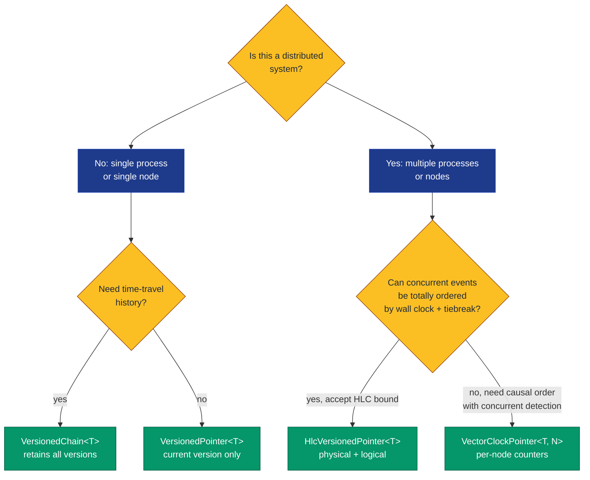
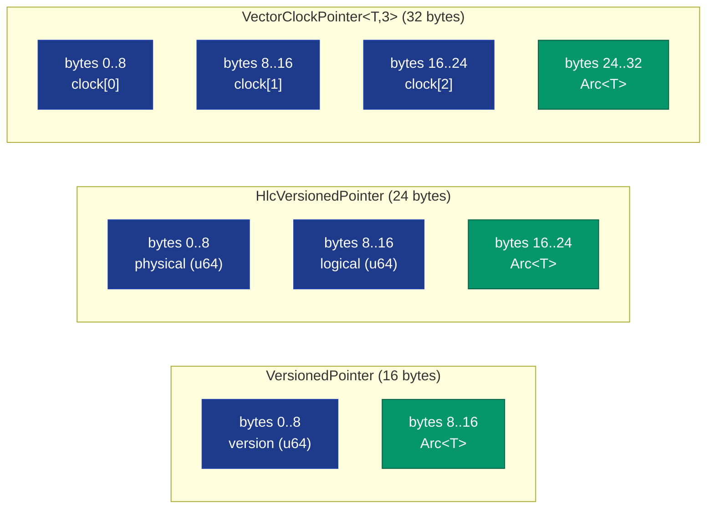
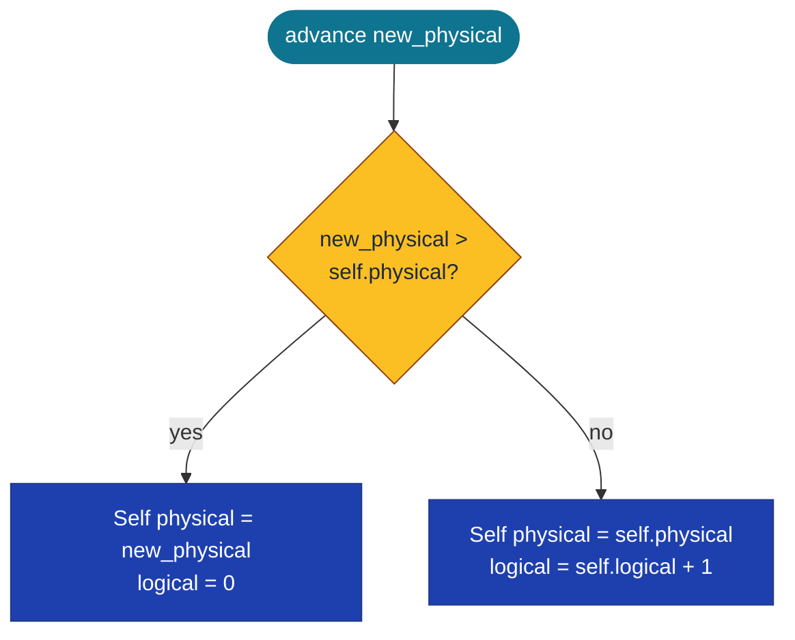

# VersionedPointer&lt;T&gt;, HlcVersionedPointer&lt;T&gt;, VectorClockPointer&lt;T, N&gt;, HybridLogicalClock, VectorClock&lt;N&gt;, VersionedChain&lt;T&gt;


Time-travel pointers for MVCC snapshot isolation, immutable
trees, and distributed causal ordering. Three pointer flavours
share a common shape `(version, target)`:

| Type | Version field | Use case |
|---|---|---|
| `VersionedPointer<T>` | `u64` (monotonic) | Local MVCC, snapshot isolation |
| `HlcVersionedPointer<T>` | `HybridLogicalClock(physical, logical)` | Distributed (HLC, CockroachDB-style) |
| `VectorClockPointer<T, N>` | `VectorClock([u64; N])` | Per-node causal ordering, concurrent-update detection (Riak-style) |

Plus `VersionedChain<T>`: a linked-list of `VersionNode<T>`s
that retains all historical versions for time-travel reads.

> **The "what was the value at time T" primitive.** Same
> architectural shape as MVCC databases, immutable persistent
> data structures, distributed CRDT systems - exposed here as
> typed primitives with bench-verified semantics.

**Constraints (read first):**

- **In-process only.** All targets are `Arc<T>`. Cross-process
  versioned storage needs an MMF-backed substrate (not shipped
  in this primitive).
- **`VersionedPointer::replace` panics on non-monotonic version.**
  MVCC requires strictly increasing versions; calling
  `replace(new_target, v)` where `v <= self.version` panics with
  a "monotonic" message. Use `try_replace` patterns externally
  if non-monotonic transitions need recovery.
- **`VersionedChain::push` panics on non-monotonic version.**
  Same contract as `replace` but for the chain head.
- **Wall-clock dependency in `HybridLogicalClock::now()`.** Uses
  `SystemTime::now()` (microseconds since UNIX epoch). On systems
  with clock skew or non-monotonic wall clock the `now()`
  constructor produces non-monotonic values; use `advance()` /
  `merge()` to recover the HLC's monotonicity contract.
- **`VectorClock<N>` is const-generic on node count.** Changing
  the node count requires changing the type; the type system
  cannot mix `VectorClock<3>` with `VectorClock<4>`. Workloads
  with dynamic node-count must pick a maximum at compile time.
- **`VectorClockPointer::read_at` returns `None` for concurrent
  events.** Concurrent (incomparable) events are surfaced as
  `None` rather than silently ordered; this is the architectural
  feature that distinguishes `VectorClock` from a single
  timestamp. Callers must handle the `None` case as "we don't
  know which came first."
- **`VersionedChain` is unbounded.** Every `push` adds a node
  retained by Arc-chain. There is no compaction or GC; callers
  bound history externally if memory is a concern. Time-travel
  reads at deep snapshots cost O(depth-from-head) per query.

---

## Table of contents

- [What they are](#what-they-are)
- [Choosing the right pointer](#choosing-the-right-pointer)
- [Memory layout](#memory-layout)
- [The HLC cascade](#the-hlc-cascade)
- [Vector clocks and concurrent detection](#vector-clocks-and-concurrent-detection)
- [VersionedChain time-travel](#versionedchain-time-travel)
- [API at a glance](#api-at-a-glance)
- [Worked example](#worked-example)
- [Benchmark results](#benchmark-results)
- [Use case patterns](#use-case-patterns)
- [Known limitations (verified)](#known-limitations-verified)
- [Common pitfalls](#common-pitfalls)

---

## What they are

`VersionedPointer<T>` - the simplest case, monotonic u64
versions:

```rust
pub struct VersionedPointer<T> {
    version: u64,
    target: Arc<T>,
}
```

`HybridLogicalClock` - a cascade of physical + logical:

```rust
pub struct HybridLogicalClock {
    pub physical: u64,    // wall-clock microseconds since UNIX epoch
    pub logical:  u64,    // monotonic counter, breaks ties
}
```

`HlcVersionedPointer<T>` - pointer + HLC:

```rust
pub struct HlcVersionedPointer<T> {
    clock: HybridLogicalClock,
    target: Arc<T>,
}
```

`VectorClock<const N: usize>` - per-node counters:

```rust
pub struct VectorClock<const N: usize> {
    pub clock: [u64; N],
}
```

`VectorClockPointer<T, const N: usize>` - pointer + per-node
clock:

```rust
pub struct VectorClockPointer<T, const N: usize> {
    clock: VectorClock<N>,
    target: Arc<T>,
}
```

`VersionedChain<T>` - linked-list of historical versions:

```rust
pub struct VersionedChain<T: Clone> {
    head: parking_lot::RwLock<Option<Arc<VersionNode<T>>>>,
}
```

## Choosing the right pointer



| Workload | Pick | Why |
|---|---|---|
| Single-process MVCC, current-only reads | `VersionedPointer<T>` | Smallest, zero overhead vs raw u64 |
| Single-process MVCC + time-travel reads | `VersionedChain<T>` | Persists historical lineage; Arc-clone forks |
| Distributed system, ordered events with potential tick collisions | `HlcVersionedPointer<T>` | Logical counter resolves same-microsecond ties |
| Distributed system, must detect concurrent updates | `VectorClockPointer<T, N>` | `causal_cmp` returns `None` on concurrent |

## Memory layout



VectorClockPointer's storage scales with `N` (8 bytes per node
plus 8 for the Arc). Const-generic so the size is known at
compile time.

## The HLC cascade

`HybridLogicalClock` lexicographic compare. For
`(physical_a, logical_a)` vs `(physical_b, logical_b)`,
`a <= b` holds when `physical_a < physical_b`, OR when both
physical values are equal AND `logical_a <= logical_b`. When
physical timestamps differ, only the physical compare runs
(~1 ns). When they collide, the logical counter
disambiguates. The architectural value: high-frequency event
streams produce many events per microsecond tick; the logical
counter prevents tied physical timestamps from being
collapsed into a single point.

`HybridLogicalClock::advance(new_physical)`:



`merge(received, local_physical)` takes the max physical and
bumps logical when physical ties; this is the canonical HLC
receiver-side update used by CockroachDB / Spanner / Yugabyte.

## Vector clocks and concurrent detection

`VectorClock<N>` is N per-node monotonic counters.
`causal_cmp(other)` returns:

| Outcome | Meaning |
|---|---|
| `Some(Less)` | every component <=, at least one < (self happens-before other) |
| `Some(Greater)` | every component >=, at least one > (other happens-before self) |
| `Some(Equal)` | every component equal (same event) |
| `None` | incomparable: some component <, another > (CONCURRENT) |

The `None` case is the architectural distinguisher. A single
timestamp can't represent "we don't know which came first";
VectorClock does. Workloads needing CRDT-style merge or
last-writer-wins conflict detection use this directly.

## VersionedChain time-travel


`read_at(snapshot_version)` walks newest-first until it finds
a node with `version <= snapshot_version`. O(depth-from-head)
linear walk. The architectural value is NOT speed (BTreeMap
beats this by ~44-104x; see bench) but **persistent historical
lineage**: cloning an `Arc<VersionNode>` retains the entire
chain at that point, allowing snapshot forks that BTreeMap
cannot express without a full copy.

## API at a glance

<details open>
<summary><b>VersionedPointer&lt;T&gt;</b></summary>

| Method | Signature | Notes |
|---|---|---|
| `new(target, version)` | `const fn(Arc<T>, u64) -> Self` | Constructor |
| `version()` | `const fn(&self) -> u64` | Borrow the version |
| `target()` | `fn(&self) -> &Arc<T>` | Borrow the target |
| `visible_at(snap)` | `const fn(&self, u64) -> bool` | `version <= snap` |
| `read_at(snap)` | `fn(&self, u64) -> Option<&T>` | Target when visible |
| `replace(new_target, new_version)` | `fn(&mut self, ..) -> u64` | Panics if `new_version <= version` |

</details>

<details open>
<summary><b>HybridLogicalClock</b></summary>

| Method | Signature | Notes |
|---|---|---|
| `new(physical, logical)` | `const fn(u64, u64) -> Self` | Manual constructor |
| `now()` | `fn() -> Self` | Wall-clock physical, logical=0 |
| `advance(new_physical)` | `fn(&self, u64) -> Self` | Increment logical OR jump physical |
| `merge(received, local_physical)` | `fn(&self, &Self, u64) -> Self` | Receiver-side HLC update |
| `Ord` / `PartialOrd` | manual impl | Lexicographic compare (physical, then logical) |

</details>

<details open>
<summary><b>HlcVersionedPointer&lt;T&gt;</b></summary>

| Method | Signature | Notes |
|---|---|---|
| `new(target, clock)` | `const fn(Arc<T>, HybridLogicalClock) -> Self` | Constructor |
| `clock()` | `const fn(&self) -> HybridLogicalClock` | Borrow the clock |
| `target()` | `fn(&self) -> &Arc<T>` | Borrow the target |
| `visible_at(snap)` | `fn(&self, HybridLogicalClock) -> bool` | Lexicographic compare |
| `read_at(snap)` | `fn(&self, HybridLogicalClock) -> Option<&T>` | Target when visible |

</details>

<details>
<summary><b>VectorClock&lt;N&gt;</b></summary>

| Method | Signature | Notes |
|---|---|---|
| `zero()` | `const fn() -> Self` | All-zero clock |
| `increment(node_idx)` | `fn(&mut self, usize)` | Bump one node's counter |
| `causal_cmp(other)` | `fn(&self, &Self) -> Option<Ordering>` | `None` = concurrent |
| `merge(other)` | `fn(&self, &Self) -> Self` | Pointwise max |

</details>

<details>
<summary><b>VectorClockPointer&lt;T, N&gt;</b></summary>

| Method | Signature | Notes |
|---|---|---|
| `new(target, clock)` | `const fn(Arc<T>, VectorClock<N>) -> Self` | Constructor |
| `clock()` | `fn(&self) -> VectorClock<N>` | Copy the clock |
| `target()` | `fn(&self) -> &Arc<T>` | Borrow the target |
| `read_at(snapshot)` | `fn(&self, VectorClock<N>) -> Option<&T>` | `None` on concurrent/future |

</details>

<details>
<summary><b>VersionedChain&lt;T: Clone&gt;</b></summary>

| Method | Signature | Notes |
|---|---|---|
| `new()` / `default()` | constructors | Empty chain |
| `push(value, new_version)` | `fn(&self, T, u64)` | Panics if non-monotonic |
| `read_at(snap)` | `fn(&self, u64) -> Option<T>` | O(depth) walk; clones value |
| `current()` | `fn(&self) -> Option<(u64, T)>` | Latest pair |
| `len()` | `fn(&self) -> usize` | O(depth) walk |
| `is_empty()` | `fn(&self) -> bool` | O(1) head check |

</details>

## Worked example

```rust
use std::sync::Arc;
use subetha_pointers::versioned_pointer::{
    HlcVersionedPointer, HybridLogicalClock,
    VectorClock, VectorClockPointer,
    VersionedChain, VersionedPointer,
};

// Pattern 1: VersionedPointer for current-version MVCC.
let mut p = VersionedPointer::new(Arc::new("hello".to_string()), 100);
assert!(p.visible_at(150));
assert!(!p.visible_at(99));
p.replace(Arc::new("world".to_string()), 101);
assert_eq!(p.version(), 101);

// Pattern 2: HLC for distributed tie-breaking.
let local = HybridLogicalClock::new(1000, 5);
let received = HybridLogicalClock::new(1000, 8);
let merged = local.merge(&received, 1000);
// Same microsecond on both sides; logical bumps past the max.
assert_eq!(merged.physical, 1000);
assert_eq!(merged.logical, 9);

// Pattern 3: VectorClock detects concurrent updates.
let a = VectorClock::<3> { clock: [1, 0, 0] };  // node 0 has an event
let c = VectorClock::<3> { clock: [0, 0, 1] };  // node 2 has an event
assert_eq!(a.causal_cmp(&c), None);  // CONCURRENT - neither precedes
let merged_vc = a.merge(&c);
assert_eq!(merged_vc.clock, [1, 0, 1]);  // pointwise max

// Pattern 4: VersionedChain time-travel.
let chain = VersionedChain::<u64>::new();
chain.push(10, 1);
chain.push(20, 2);
chain.push(30, 3);
assert_eq!(chain.read_at(2), Some(20));  // mid-history read
assert_eq!(chain.read_at(99), Some(30)); // post-history read returns head
assert_eq!(chain.read_at(0), None);      // pre-history read returns None
```

## Benchmark results

Bench: `crates/subetha-pointers/benches/versioned_bloom.rs`
(`versioned_*`, `hlc_*`, `vector_clock_*` groups). Measured on
Windows 11 / Zen+ R7 2700, criterion at `--measurement-time 2
--warm-up-time 1 --sample-size 30` (middle estimate of each
[low, mid, high] triple). All workloads scan 1024 entries unless
noted.

### Visibility scan: VersionedPointer is free vs raw u64

| Workload | Time | Per-entry | Ratio |
|---|---:|---:|---:|
| `versioned.visibility_scan/native_u64_compare` | 562 ns | 0.55 ns | baseline |
| `versioned.visibility_scan/versioned_pointer` | 555 ns | 0.54 ns | **parity** |

The `Arc<T>` wrapping adds no measurable cost to the visibility
check. The architectural value is type-level safety (callers
cannot accidentally compare versions from different MVCC
instances) and lifetime management; bench shows the runtime
cost is zero.

### Chain time-travel: BTreeMap wins on cost, chain wins on lineage

100-element chain / BTreeMap. Time-travel reads at three depths:

| Workload | Chain | BTreeMap | BTreeMap wins by |
|---|---:|---:|---:|
| `read_at_head` (depth 1) | 42 ns | 21 ns | 2.0x |
| `read_at_mid` (depth 50) | 732 ns | 17 ns | **44x** |
| `read_at_root` (depth 100) | 1422 ns | 14 ns | **104x** |

`VersionedChain::read_at` walks newest-to-oldest via Arc-clone;
each hop is ~14 ns. `BTreeMap::range(..=snap).next_back()` is
an O(log n) range-tree descent.

**The architectural value of VersionedChain isn't read cost** -
it is **persistent lineage retention**. Cloning the chain at
any point keeps the entire history alive through the Arc graph,
which a BTreeMap cannot do without a full copy. Workloads
that fork snapshots, take consistent backups across versions,
or implement CoW history (Git tree-style) use the chain; pure
"latest visible at snapshot" workloads use BTreeMap.

### HLC tie-breaking: cascade resolves same-tick events correctly

1024 events spread across 16 physical ticks (~64 events per
tick). Snapshot HLC(8, 32) lands mid-tick.

| Workload | Time | Per-entry | Visible count |
|---|---:|---:|---:|
| `hlc.tie_breaking_scan/native_tuple_compare` | 1.31 us | 1.28 ns | correct (~544) |
| `hlc.tie_breaking_scan/hlc_pointer` | 983 ns | 0.96 ns | correct (~544) |
| `hlc.tie_breaking_scan/single_u64_lossy` | 556 ns | 0.54 ns | **WRONG** (576 - overcounts by 32) |

`hlc_pointer` is **1.33x faster than the tuple baseline** (same
data, different layout - HLC's compile-time-known field layout
gives the compiler more inlining opportunity).

The `single_u64_lossy` row is the **correctness diagnostic**:
it uses only the physical timestamps and misclassifies all 32
events at the snapshot's tick as "visible." Speed is 1.77x
faster than HLC but the answer is wrong. The architectural
value of HLC is the logical counter that breaks tied physical
timestamps; collapsing to a single u64 saves ~43% cost and loses
30+ events per query at tied ticks.

### Vector clock causal classification: pays cost to detect concurrent

1024 pairs of 3-node vector clocks with mixed causal /
concurrent relations.

| Workload | Time | Per-pair | Capability |
|---|---:|---:|---|
| `vector_clock.causal_classify/native_max_compare` | 1.79 us | 1.74 ns | LOSES concurrency detection |
| `vector_clock.causal_classify/vector_clock_cmp` | 3.92 us | 3.83 ns | detects concurrent (None) |
| `vector_clock.causal_classify/vector_clock_pointer_read_at` | 5.55 us | 5.42 ns | scan + read filter |

`vector_clock_cmp` is **2.20x slower than native_max_compare**.
The native compare reduces each clock to its max element and
compares those; this imposes a total order on logically
concurrent events (overcounts ordered relationships by
classifying concurrent events as one-side-less-than the other).

**This is the cost of correctness for distributed causal
ordering.** Workloads that don't need concurrency detection
should not use VectorClock - a u64 or HLC suffices. Workloads
that do (CRDT merge, last-writer-wins with conflict surfacing)
pay ~2x for the typed `causal_cmp` and the architectural
guarantee that concurrent events surface as `None`.

## Use case patterns

<details>
<summary><b>Pattern 1: MVCC snapshot reads</b></summary>

A database transaction at snapshot version V scans a table of
`VersionedPointer<Row>` and reads only `visible_at(V)` rows.
Writes create new pointers with monotonic version assignments;
old pointers stay in the table for concurrent reads at earlier
snapshots until garbage-collected.

</details>

<details>
<summary><b>Pattern 2: distributed event log with HLC ordering</b></summary>

CockroachDB / Spanner-style: every event is tagged with
`HlcVersionedPointer<Event>` at creation time. The HLC's
physical component reflects approximate wall-clock; the
logical counter resolves ties. Cross-node reads use the
recipient's `merge(received, local_now)` to update the
receiver's local clock.

</details>

<details>
<summary><b>Pattern 3: CRDT merge with concurrent update detection</b></summary>

A distributed key-value store with N nodes uses
`VectorClockPointer<Value, N>` per key. On a write, the writer
increments its node's counter. On a read, the reader compares
the local clock vs the received clock via `causal_cmp`:

- `Less` / `Equal` - apply the received value (causal update)
- `Greater` - keep the local value (stale received)
- `None` - **conflict, apply CRDT merge or last-writer-wins**

The architectural value: the `None` case is detected
explicitly, not hidden behind a lossy total order.

</details>

<details>
<summary><b>Pattern 4: persistent immutable tree with version forks</b></summary>

A version-controlled document store retains all historical
versions via `VersionedChain<DocSnapshot>`. Forking a branch
clones the chain's head Arc; both branches share history up
to the fork point, then diverge via per-branch chain pushes.
The Arc graph keeps shared history alive; only the diverged
suffixes consume new memory.

</details>

## Known limitations (verified)

1. **In-process only.** All targets are `Arc<T>`; the version
   data structure is heap-allocated and not portable across
   processes.

2. **`replace` panics on non-monotonic version.** The bench-
   verified test `versioned_pointer_replace_rejects_non_monotonic`
   confirms the panic message includes both versions.

3. **`VersionedChain::push` panics on non-monotonic version.**
   Same contract as `replace`; verified by
   `versioned_chain_push_rejects_non_monotonic`.

4. **`HybridLogicalClock::now` reads wall clock.** On systems
   with clock skew (NTP corrections, virtualization, system
   clock changes) the `now` constructor produces non-monotonic
   physical values within the same process. Use `advance` /
   `merge` to recover the HLC's monotonicity contract.

5. **`VectorClock::N` is const-generic.** Mixing nodes with
   different `N` is a type error. Workloads with dynamic node
   counts must pick a maximum (and pad smaller clocks with
   zero) at compile time.

6. **`VectorClockPointer::read_at` returns `None` for
   concurrent.** The caller must handle this distinctly from
   "future event" - both return `None` but they have different
   semantics. Use `causal_cmp` directly when the distinction
   matters.

7. **`VersionedChain` is unbounded.** No compaction or GC;
   every push is retained until the chain is dropped. Memory
   grows linearly with version count. Read cost at depth D is
   ~14 ns * D (linear walk).

8. **`VersionedChain::read_at` is O(depth-from-head).** BTreeMap
   beats it by ~44-104x on read perf at depth 50-100. Choose
   based on architectural need (lineage retention vs read
   speed), not raw throughput.

9. **`VersionedChain::push` takes a write lock** (parking_lot
   RwLock). Concurrent writers serialize; readers are
   lock-free. For high-write-rate workloads, partition across
   multiple chains.

10. **`HybridLogicalClock` ordering is a manual `impl Ord`**
    (lexicographic: `physical.cmp().then(logical.cmp())`). It
    uses `u64::cmp`, which is unsigned and correct across the
    full `0..=u64::MAX` range - there is no signedness or
    wrap-around hazard.

## Common pitfalls

<details>
<summary><b>Pitfall 1: assuming `read_at(None)` means "not found"</b></summary>

`VectorClockPointer::read_at` returns `None` for TWO cases:

1. **Future event**: the pointer's clock is after the snapshot.
2. **Concurrent event**: the pointer's clock is incomparable
   to the snapshot (some component <, another >).

Both look like `None` but have different semantics. If your
workload needs to distinguish these, use `causal_cmp` directly:

```rust
match ptr.clock().causal_cmp(&snapshot) {
    Some(Ordering::Less | Ordering::Equal) => /* visible */,
    Some(Ordering::Greater) => /* future event */,
    None => /* CONCURRENT - handle specially */,
}
```

</details>

<details>
<summary><b>Pitfall 2: forgetting `HLC::merge` on event receipt</b></summary>

```rust
// WRONG: just take the received clock as-is.
let received = ...;
local_clock = received;  // ignores local progress, breaks HLC invariant
```

The HLC invariant is that the receiver's clock dominates both
the local and received clocks AND the local wall clock.
`merge(received, local_physical)` is the canonical update.

</details>

<details>
<summary><b>Pitfall 3: VersionedChain memory growth</b></summary>

```rust
let chain = VersionedChain::<BigBlob>::new();
for v in 1..1_000_000 {
    chain.push(blob.clone(), v);
}
// 1M nodes retained; memory grows linearly.
```

The chain has no built-in compaction. For workloads with
high update rate, either:

- Periodically replace the chain (drop the old one once readers
  have moved past it), or
- Use `VersionedPointer<T>` if only current state matters, or
- Use BTreeMap with explicit eviction below a watermark.

</details>

<details>
<summary><b>Pitfall 4: time-travel performance assumptions</b></summary>

The bench shows BTreeMap is ~44-104x faster than VersionedChain
for time-travel reads. If your workload doesn't need
**persistent lineage** (the ability to fork an entire chain
by cloning one Arc), use BTreeMap instead.

The chain's architectural value is exactly the persistent
forking. Without that requirement, you're paying linear walk
cost for nothing.

</details>

---

[back to subetha-pointers docs](../../)
