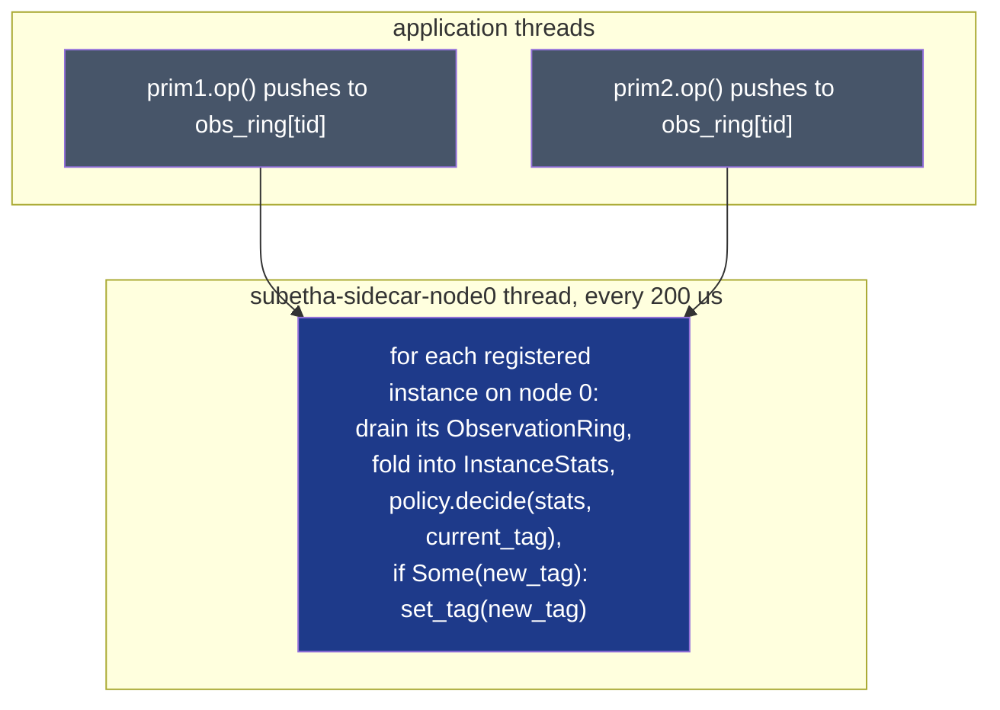

# The sidecar control plane (`subetha-sidecar`)

`subetha-sidecar` is the per-NUMA control plane that drains
observation rings, accumulates `InstanceStats`, and calls each
instance's `Policy` to decide migrations.

## Public surface

| Type / function | Role |
|---|---|
| `Sidecar` | global registry + per-NUMA scan threads |
| `AdaptiveInstance` trait | the contract a primitive satisfies to be registerable |
| `SidecarBox<T: AdaptiveInstance>` | RAII wrapper: registers on `new`, unregisters on `Drop` |
| `SidecarHandle` | auto-unregistering handle held inside `SidecarBox` |
| `Policy` trait | decides whether a migration is warranted |
| `FixedPolicy(u32)` | always returns `Some(tag)` (testing) |
| `NoMigrationPolicy` | always returns `None` (default for primitives without a shipped policy) |
| `InstanceStats` | drain-and-fold accumulator the sidecar maintains per instance |
| `InstanceId` | `u32` packing `(node_index: 8 bits, slot: 24 bits)` |
| `global() -> Arc<Sidecar>` | lazy-init access to the process-global sidecar |
| `numa_node_count() -> u32` | detected NUMA topology (clamped to ≥ 1) |
| `current_numa_node() -> u32` | which node the current thread is bound to |

## Architecture



- **One scan thread per detected NUMA node.** Each thread is named
  `subetha-sidecar-node{N}` and polls every 200 µs
  (`POLL_INTERVAL = Duration::from_micros(200)`).
- **Instance routing**: each `InstanceId` is `(node: 8 bits, slot: 24
  bits)`. The slot lives in `NodeSidecar.instances[node]` so the
  scan thread for node N only touches the slots bound to its node.
- **Hard cap**: 10,000 simultaneously-registered instances
  (`DEFAULT_MAX_INSTANCES`). `Sidecar::set_max_instances` raises the
  cap. Crossing it from `register_raw` panics with a diagnostic.

## The minimal flow

A primitive becomes adaptive by satisfying three contracts:

1. Holds a `HandshakeHeader` field and an `ObservationRing` field.
2. Implements `AdaptiveInstance`: returns references to those
   fields plus a `make_policy()` factory.
3. Pushes one `Observation` per public op to its `ObservationRing`.

Then a caller wraps the primitive in `SidecarBox::new(primitive)`.
The box registers the instance with the global sidecar (capturing
raw pointers to the header + ring), receives an `InstanceId`,
and arranges to unregister on `Drop`.

## API surface

```rust,no_run
pub trait AdaptiveInstance: Send + Sync + 'static {
    fn header(&self) -> &HandshakeHeader;
    fn ring(&self) -> &ObservationRing;
    fn make_policy(&self) -> Box<dyn Policy>;
    // Optional: implement `apply_migration` for primitives that need
    // dual-stack data swap on tag change. Default is no-op (set_tag
    // only).
}

pub fn global() -> Arc<Sidecar>;

impl Sidecar {
    pub fn unregister(&self, id: InstanceId);
    pub fn instance_count(&self) -> usize;
    pub fn max_instances(&self) -> usize;
    pub fn set_max_instances(&self, cap: usize);
    pub fn stats(&self, id: InstanceId) -> Option<InstanceStats>;
    pub fn scan_now(&self);                    // force one scan immediately
    pub fn node_count(&self) -> usize;
}
```

## Capacity constants

| Constant | Value | Meaning |
|---|---|---|
| `N_OP_KINDS` | 8 | per-primitive op-kind enum size; index 0 reserved for "unspecified" |
| `MAX_TRACKED_THREADS_PER_KIND` | 4 | cardinality cache size; counts saturate at `MAX + 1` |
| `DEFAULT_MAX_INSTANCES` | 10,000 | hard cap on simultaneously-registered instances |
| `POLL_INTERVAL` | 200 µs | scan thread sleep between iterations |
| `NODE_ID_BITS` | 8 | upper bits of `InstanceId` reserved for NUMA node index |

## See also

- [`AdaptiveInstance` trait](adaptive-instance.md)
- [`Policy` trait + built-in policies](policy.md)
- [`SidecarBox<T>` RAII registration](sidecar-box.md)
- [`InstanceStats` accumulator](instance-stats.md)
- [Global registry + scan thread internals](registry.md)
